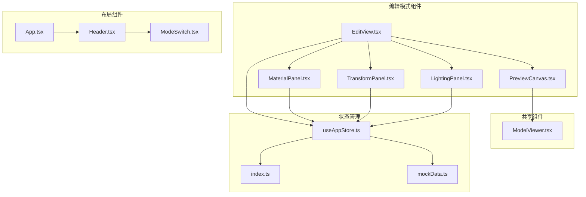
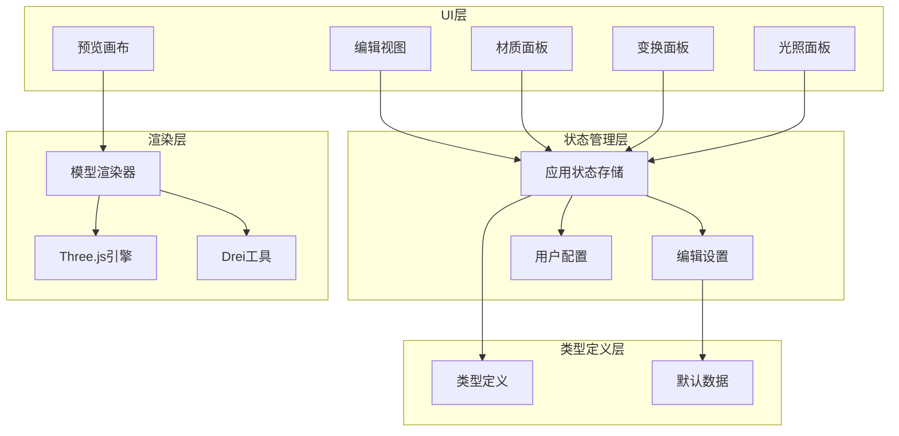
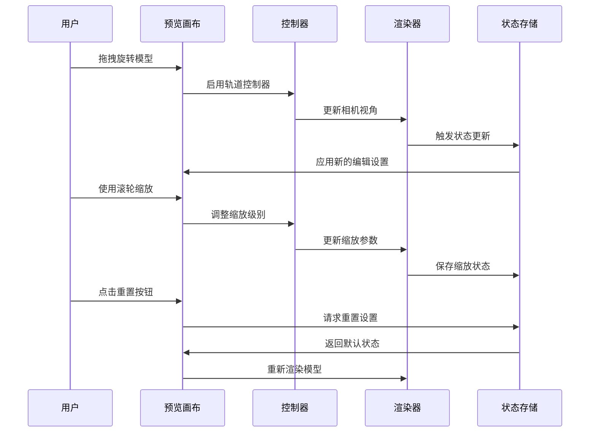
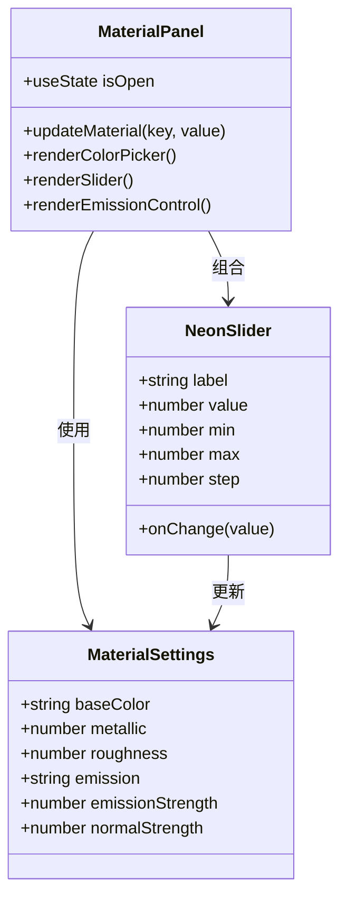
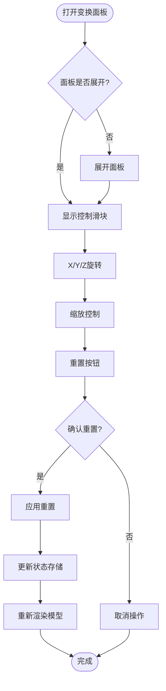
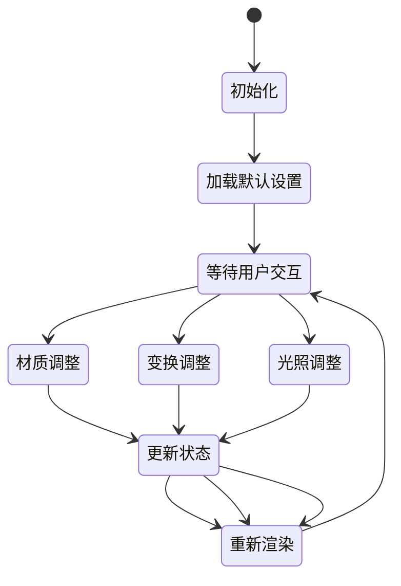
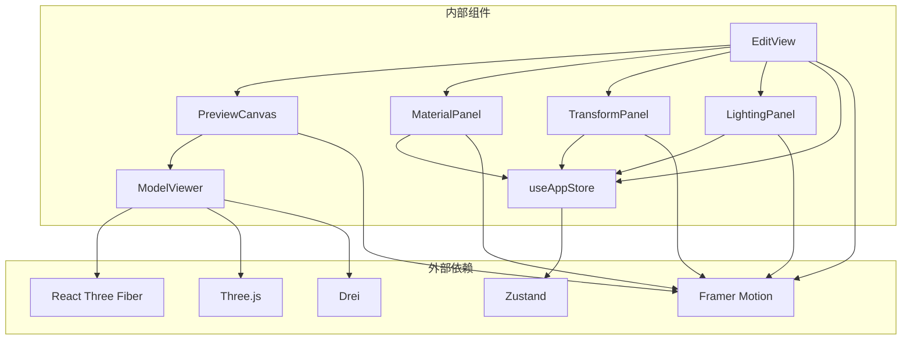

# 编辑模式（3D模型编辑）

<cite>
**本文档引用的文件**
- [EditView.tsx](file://src/components/Edit/EditView.tsx)
- [PreviewCanvas.tsx](file://src/components/Edit/PreviewCanvas.tsx)
- [MaterialPanel.tsx](file://src/components/Edit/MaterialPanel.tsx)
- [TransformPanel.tsx](file://src/components/Edit/TransformPanel.tsx)
- [LightingPanel.tsx](file://src/components/Edit/LightingPanel.tsx)
- [ModelViewer.tsx](file://src/components/Shared/ModelViewer.tsx)
- [useAppStore.ts](file://src/store/useAppStore.ts)
- [index.ts](file://src/types/index.ts)
- [mockData.ts](file://src/utils/mockData.ts)
- [Header.tsx](file://src/components/Layout/Header.tsx)
- [ModeSwitch.tsx](file://src/components/Layout/ModeSwitch.tsx)
- [App.tsx](file://src/App.tsx)
</cite>

## 目录
1. [简介](#简介)
2. [项目结构](#项目结构)
3. [核心组件](#核心组件)
4. [架构概览](#架构概览)
5. [详细组件分析](#详细组件分析)
6. [依赖关系分析](#依赖关系分析)
7. [性能考虑](#性能考虑)
8. [故障排除指南](#故障排除指南)
9. [结论](#结论)

## 简介

编辑模式是3D模型代理系统中的核心功能模块，为用户提供了一个完整的3D模型实时编辑工作流。该模式集成了预览画布、材质面板、变换面板和光照面板，支持从基础到专业的多层次编辑体验。

编辑模式基于React和Three.js构建，采用现代前端技术栈，提供了流畅的用户体验和强大的3D渲染能力。系统支持多种编辑视图模式（简洁模式和专业模式），并通过用户等级系统实现了渐进式功能解锁。

## 项目结构

编辑模式的文件组织遵循功能模块化的架构原则，主要组件分布如下：

**图表来源**
- [EditView.tsx:1-159](file://src/components/Edit/EditView.tsx#L1-L159)
- [PreviewCanvas.tsx:1-54](file://src/components/Edit/PreviewCanvas.tsx#L1-L54)
- [ModelViewer.tsx:1-156](file://src/components/Shared/ModelViewer.tsx#L1-L156)

**章节来源**
- [EditView.tsx:1-159](file://src/components/Edit/EditView.tsx#L1-L159)
- [App.tsx:1-33](file://src/App.tsx#L1-L33)

## 核心组件

编辑模式的核心由四个主要面板组成，每个面板都提供了特定的编辑功能：

### 预览画布（PreviewCanvas）
预览画布是3D模型编辑的中央显示区域，负责实时渲染用户修改的3D模型。它集成了Three.js的3D渲染能力和用户交互控制。

### 材质面板（MaterialPanel）
材质面板允许用户精确控制3D模型的表面属性，包括基础颜色、金属度、粗糙度、自发光等材质参数。

### 变换面板（TransformPanel）
变换面板提供几何编辑功能，支持模型的位置、旋转和缩放的精确控制，确保用户能够进行精细的几何调整。

### 光照面板（LightingPanel）
光照面板用于设置环境光照和背景，提供多种预设光照场景，帮助用户在不同环境下测试模型效果。

**章节来源**
- [EditView.tsx:22-114](file://src/components/Edit/EditView.tsx#L22-L114)
- [PreviewCanvas.tsx:8-25](file://src/components/Edit/PreviewCanvas.tsx#L8-L25)

## 架构概览

编辑模式采用分层架构设计，通过状态管理实现组件间的解耦和数据共享：

**图表来源**
- [useAppStore.ts:100-163](file://src/store/useAppStore.ts#L100-L163)
- [ModelViewer.tsx:136-156](file://src/components/Shared/ModelViewer.tsx#L136-L156)

**章节来源**
- [useAppStore.ts:100-311](file://src/store/useAppStore.ts#L100-L311)
- [ModelViewer.tsx:1-156](file://src/components/Shared/ModelViewer.tsx#L1-156)

## 详细组件分析

### 预览画布交互机制

预览画布是编辑模式的核心交互界面，基于Three.js和@react-three/fiber构建，提供了丰富的3D模型交互能力：

**图表来源**
- [PreviewCanvas.tsx:12-24](file://src/components/Edit/PreviewCanvas.tsx#L12-L24)
- [ModelViewer.tsx:119-123](file://src/components/Shared/ModelViewer.tsx#L119-L123)

预览画布的主要特性包括：
- **实时缩放**：支持鼠标滚轮和触摸手势的缩放操作
- **自由旋转**：通过拖拽实现360度全方位视角浏览
- **网格辅助**：显示地面网格帮助用户理解模型尺寸
- **环境贴图**：提供多种光照环境预设

**章节来源**
- [PreviewCanvas.tsx:1-54](file://src/components/Edit/PreviewCanvas.tsx#L1-L54)
- [ModelViewer.tsx:82-126](file://src/components/Shared/ModelViewer.tsx#L82-L126)

### 材质面板功能详解

材质面板提供了全面的材质属性控制系统，支持物理渲染（PBR）材质的精确调整：

**图表来源**
- [MaterialPanel.tsx:71-209](file://src/components/Edit/MaterialPanel.tsx#L71-L209)
- [index.ts:84-91](file://src/types/index.ts#L84-L91)

材质面板的关键功能：
- **基础颜色控制**：支持十六进制颜色选择和RGB值输入
- **金属度调节**：范围0-1，控制表面金属质感
- **粗糙度控制**：范围0-1，影响表面反射特性
- **自发光效果**：独立的颜色和强度控制
- **法线贴图强度**：增强表面细节表现力

**章节来源**
- [MaterialPanel.tsx:1-209](file://src/components/Edit/MaterialPanel.tsx#L1-L209)
- [index.ts:84-91](file://src/types/index.ts#L84-L91)

### 变换面板几何编辑能力

变换面板专注于几何参数的精确控制，提供直观的滑块界面：

**图表来源**
- [TransformPanel.tsx:29-102](file://src/components/Edit/TransformPanel.tsx#L29-L102)

变换面板支持的操作：
- **三维旋转**：分别控制X、Y、Z轴的旋转角度（-180°到180°）
- **统一缩放**：0.1到3倍的连续缩放范围
- **即时预览**：每次调整立即反映在3D预览中
- **一键重置**：快速恢复到初始状态

**章节来源**
- [TransformPanel.tsx:1-102](file://src/components/Edit/TransformPanel.tsx#L1-L102)

### 光照面板环境设置

光照面板提供了四种不同的光照环境预设，每种预设都有特定的视觉效果：

| 预设名称 | 图标 | 描述 | 适用场景 |
|---------|------|------|----------|
| 影棚 | 🎬 | 柔和均匀照明 | 产品展示、静物摄影 |
| 室外 | ☀️ | 自然日光环境 | 户外场景、日间测试 |
| 戏剧 | 🌙 | 强对比高光 | 艺术创作、特殊效果 |
| 中性 | 💡 | 无偏色灯光 | 颜色准确性验证 |

**章节来源**
- [LightingPanel.tsx:7-12](file://src/components/Edit/LightingPanel.tsx#L7-L12)
- [ModelViewer.tsx:25-30](file://src/components/Shared/ModelViewer.tsx#L25-L30)

### 状态管理系统

编辑模式的状态管理采用Zustand库实现，提供了响应式的状态更新机制：

**图表来源**
- [useAppStore.ts:160-163](file://src/store/useAppStore.ts#L160-L163)

**章节来源**
- [useAppStore.ts:100-311](file://src/store/useAppStore.ts#L100-L311)

## 依赖关系分析

编辑模式的组件间依赖关系体现了清晰的分层架构：

**图表来源**
- [ModelViewer.tsx:1-4](file://src/components/Shared/ModelViewer.tsx#L1-L4)
- [useAppStore.ts:1-15](file://src/store/useAppStore.ts#L1-L15)

**章节来源**
- [ModelViewer.tsx:1-156](file://src/components/Shared/ModelViewer.tsx#L1-L156)
- [useAppStore.ts:1-368](file://src/store/useAppStore.ts#L1-L368)

## 性能考虑

编辑模式在性能优化方面采用了多项策略：

### 渲染优化
- **按需渲染**：仅在状态变化时重新渲染3D场景
- **组件记忆化**：使用React.memo避免不必要的组件重渲染
- **几何缓存**：使用useMemo缓存几何体计算结果

### 内存管理
- **状态持久化**：通过localStorage减少重复初始化开销
- **资源复用**：共享Three.js对象和材质实例
- **懒加载**：使用Suspense延迟加载大型3D资源

### 用户体验优化
- **即时反馈**：滑块操作立即反映在3D预览中
- **流畅动画**：使用Framer Motion实现平滑的UI过渡
- **响应式设计**：适配不同屏幕尺寸和设备

## 故障排除指南

### 常见问题及解决方案

**问题1：3D模型无法显示**
- 检查浏览器是否支持WebGL
- 确认网络连接正常，资源可访问
- 尝试清除浏览器缓存后重试

**问题2：材质调整无效**
- 确认当前处于编辑模式而非探索模式
- 检查材质值是否在有效范围内
- 刷新页面后重试

**问题3：交互响应迟缓**
- 关闭其他占用CPU的浏览器标签
- 减少同时运行的应用程序数量
- 降低图形质量设置

**问题4：状态丢失**
- 检查浏览器是否启用了localStorage
- 确认没有清理浏览器数据
- 重新登录账户以恢复用户设置

**章节来源**
- [useAppStore.ts:314-325](file://src/store/useAppStore.ts#L314-L325)

## 结论

编辑模式作为3D模型代理系统的核心功能，成功地将复杂的3D编辑任务封装为直观易用的界面。通过精心设计的组件架构和状态管理系统，用户可以在一个统一的界面中完成从材质调整到几何编辑的全部工作流程。

系统的渐进式功能解锁机制确保了学习曲线的合理性，而多层次的编辑视图满足了从初学者到专家用户的不同需求。基于Three.js的高性能渲染和响应式的用户界面，为用户提供了流畅且富有表现力的3D编辑体验。

未来的发展方向包括支持更多几何体类型、增强材质编辑功能、添加更多光照预设，以及优化移动端的交互体验。这些改进将进一步提升编辑模式的专业性和易用性。