# 预览画布

<cite>
**本文引用的文件列表**
- [PreviewCanvas.tsx](file://src/components/Edit/PreviewCanvas.tsx)
- [ModelViewer.tsx](file://src/components/Shared/ModelViewer.tsx)
- [useAppStore.ts](file://src/store/useAppStore.ts)
- [index.ts](file://src/types/index.ts)
- [MaterialPanel.tsx](file://src/components/Edit/MaterialPanel.tsx)
- [LightingPanel.tsx](file://src/components/Edit/LightingPanel.tsx)
- [TransformPanel.tsx](file://src/components/Edit/TransformPanel.tsx)
- [EditView.tsx](file://src/components/Edit/EditView.tsx)
- [ModeSwitch.tsx](file://src/components/Layout/ModeSwitch.tsx)
- [mockData.ts](file://src/utils/mockData.ts)
- [package.json](file://package.json)
</cite>

## 目录
1. [简介](#简介)
2. [项目结构](#项目结构)
3. [核心组件](#核心组件)
4. [架构总览](#架构总览)
5. [详细组件分析](#详细组件分析)
6. [依赖关系分析](#依赖关系分析)
7. [性能考量](#性能考量)
8. [故障排查指南](#故障排查指南)
9. [结论](#结论)
10. [附录](#附录)

## 简介
本文件聚焦“预览画布”组件，系统性阐述其在 Three.js 场景中的实现原理，包括场景管理、相机控制、模型渲染、材质与光照、用户交互（鼠标拖拽旋转、滚轮缩放、右键平移）、响应式布局与视图模式（简单模式 vs 专业模式）、以及与全局状态管理的数据流。同时给出性能优化策略与最佳实践，并解释与 Zustand 状态库的集成方式。

## 项目结构
预览画布位于编辑视图中，作为左侧主内容区域的核心组件，右侧为材质、光照、变换等参数面板。整体采用双栏布局，编辑视图根据视图模式（简单/专业）动态调整布局比例与可见信息。

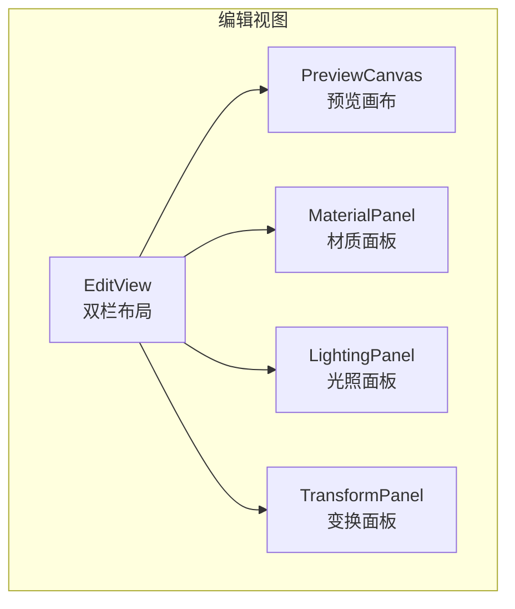

图表来源
- [EditView.tsx:1-26](file://src/components/Edit/EditView.tsx#L1-L26)
- [PreviewCanvas.tsx:1-54](file://src/components/Edit/PreviewCanvas.tsx#L1-L54)

章节来源
- [EditView.tsx:1-26](file://src/components/Edit/EditView.tsx#L1-L26)
- [PreviewCanvas.tsx:1-54](file://src/components/Edit/PreviewCanvas.tsx#L1-L54)

## 核心组件
- 预览画布容器：负责布局、控制按钮与信息覆盖层，内部嵌入 3D 模型查看器。
- 模型查看器：基于 @react-three/fiber 与 @react-three/drei 构建，封装场景、几何体、材质、光照与轨道控制器。
- 全局状态：通过 Zustand 管理编辑设置（材质、旋转、缩放、光照、背景），驱动画布渲染与面板联动。
- 参数面板：材质、光照、变换面板通过状态更新触发画布重渲染。

章节来源
- [PreviewCanvas.tsx:1-54](file://src/components/Edit/PreviewCanvas.tsx#L1-L54)
- [ModelViewer.tsx:1-156](file://src/components/Shared/ModelViewer.tsx#L1-L156)
- [useAppStore.ts:1-451](file://src/store/useAppStore.ts#L1-L451)

## 架构总览
预览画布采用“容器-展示分离”的结构：
- 容器组件（PreviewCanvas）负责布局与控制按钮，接收全局状态并传递给 ModelViewer。
- 展示组件（ModelViewer）封装 Three.js 场景，包含几何体、材质、光照与轨道控制器。
- 全局状态（Zustand）集中管理编辑设置，参数面板与画布之间通过状态同步实现双向联动。

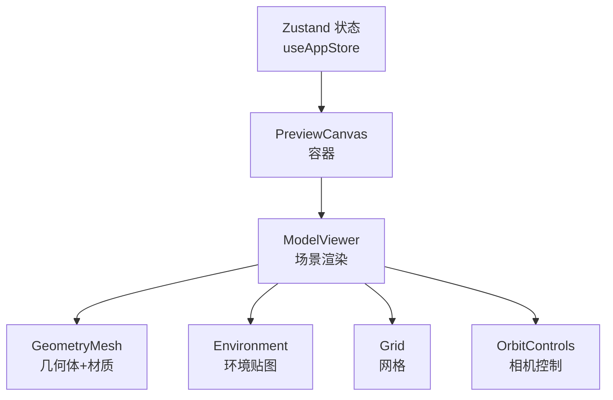

图表来源
- [PreviewCanvas.tsx:1-54](file://src/components/Edit/PreviewCanvas.tsx#L1-L54)
- [ModelViewer.tsx:1-156](file://src/components/Shared/ModelViewer.tsx#L1-L156)
- [useAppStore.ts:1-451](file://src/store/useAppStore.ts#L1-L451)

## 详细组件分析

### 预览画布容器（PreviewCanvas）
- 负责外层布局与控制按钮（缩放、复位、最大化等），信息覆盖层显示模型统计信息。
- 将全局编辑设置（材质、旋转、缩放、光照、背景）透传给 ModelViewer。
- 响应式：控制按钮与信息层固定定位，画布占满容器高度与宽度。

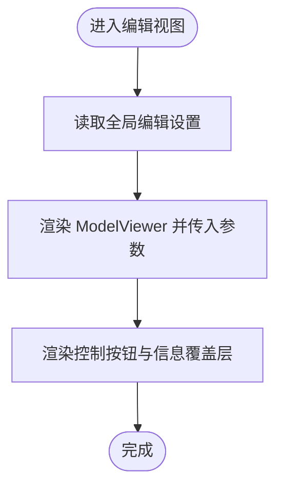

图表来源
- [PreviewCanvas.tsx:1-54](file://src/components/Edit/PreviewCanvas.tsx#L1-L54)
- [useAppStore.ts:174-177](file://src/store/useAppStore.ts#L174-L177)

章节来源
- [PreviewCanvas.tsx:1-54](file://src/components/Edit/PreviewCanvas.tsx#L1-L54)

### 模型查看器（ModelViewer）
- 场景组织：环境光、方向光、环境贴图、网格、几何体与材质、轨道控制器。
- 几何体与材质：支持多种几何体（盒、球、环面、圆柱、圆锥、环面结），材质使用标准材质（支持金属度、粗糙度、自发光）。
- 相机与渲染：Canvas 设置相机位置与视野，启用抗锯齿与透明背景；轨道控制器默认启用缩放与平移。
- 自动旋转：可选的自动旋转逻辑，按帧更新旋转角度。
- 网格与背景：网格仅在非紧凑模式下显示；背景色可配置。

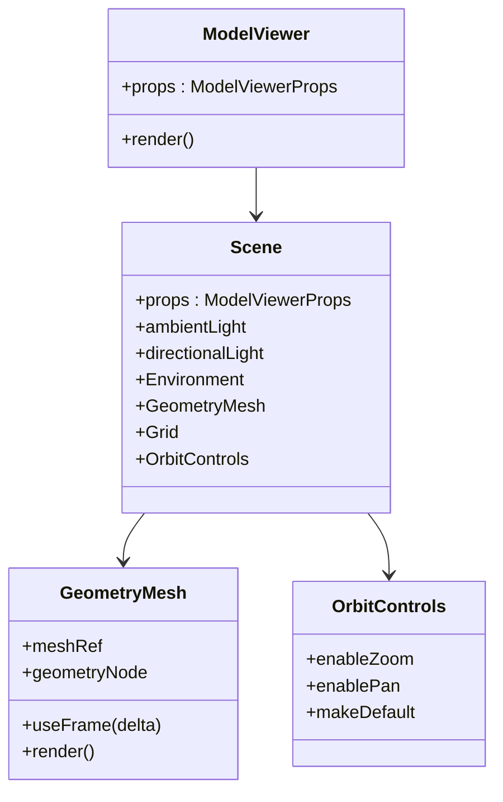

图表来源
- [ModelViewer.tsx:1-156](file://src/components/Shared/ModelViewer.tsx#L1-L156)

章节来源
- [ModelViewer.tsx:1-156](file://src/components/Shared/ModelViewer.tsx#L1-L156)

### 用户交互与相机控制
- 鼠标拖拽旋转：由轨道控制器提供，支持围绕模型的视角旋转。
- 滚轮缩放：轨道控制器启用缩放，默认在非紧凑模式可用。
- 右键平移：轨道控制器启用平移，默认在非紧凑模式可用。
- 复位与最大化：控制按钮用于复位相机与切换全屏（可通过外部样式或容器尺寸实现）。

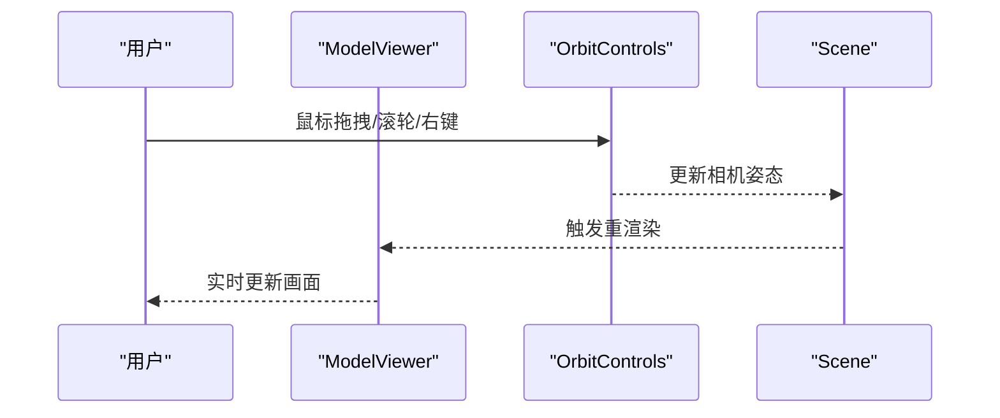

图表来源
- [ModelViewer.tsx:119-123](file://src/components/Shared/ModelViewer.tsx#L119-L123)

章节来源
- [ModelViewer.tsx:119-123](file://src/components/Shared/ModelViewer.tsx#L119-L123)

### 材质应用与实时渲染
- 材质参数：基础颜色、金属度、粗糙度、自发光颜色与强度、法线贴图强度。
- 实时更新：材质属性通过全局状态更新，触发画布重渲染。
- 面板联动：材质面板提供滑块与颜色选择器，直接修改全局状态。

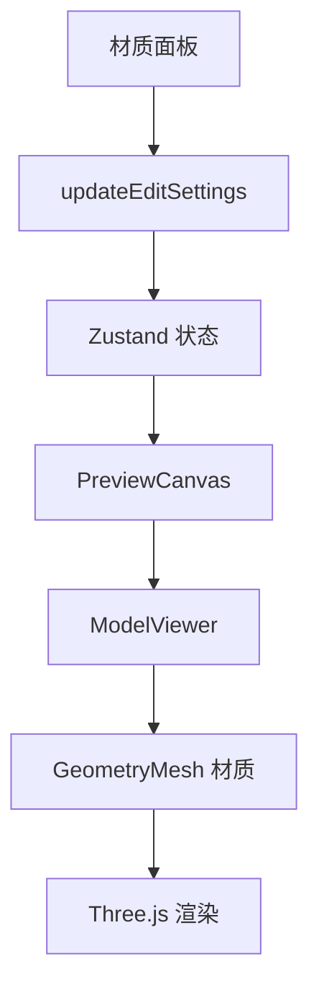

图表来源
- [MaterialPanel.tsx:71-209](file://src/components/Edit/MaterialPanel.tsx#L71-L209)
- [useAppStore.ts:174-177](file://src/store/useAppStore.ts#L174-L177)
- [ModelViewer.tsx:64-79](file://src/components/Shared/ModelViewer.tsx#L64-L79)

章节来源
- [MaterialPanel.tsx:71-209](file://src/components/Edit/MaterialPanel.tsx#L71-L209)
- [ModelViewer.tsx:64-79](file://src/components/Shared/ModelViewer.tsx#L64-L79)

### 光照与环境贴图
- 光照预设：影棚、室外、戏剧、中性四种环境贴图预设。
- 环境光与方向光：统一场景光照基础，配合环境贴图增强真实感。
- 背景色：可配置背景色，影响画布背景。

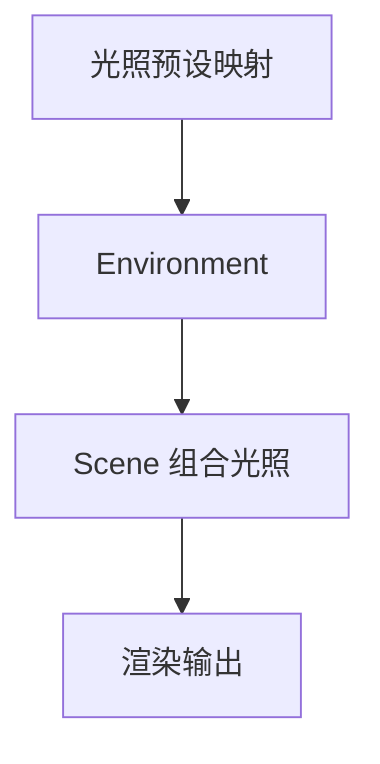

图表来源
- [ModelViewer.tsx:25-30](file://src/components/Shared/ModelViewer.tsx#L25-L30)
- [ModelViewer.tsx:91-102](file://src/components/Shared/ModelViewer.tsx#L91-L102)

章节来源
- [ModelViewer.tsx:25-30](file://src/components/Shared/ModelViewer.tsx#L25-L30)
- [ModelViewer.tsx:91-102](file://src/components/Shared/ModelViewer.tsx#L91-L102)

### 变换控制（旋转与缩放）
- 旋转：支持绕 X/Y/Z 轴旋转，范围与步进由面板定义。
- 缩放：支持整体缩放，范围与步进由面板定义。
- 复位：一键恢复到初始旋转与缩放。

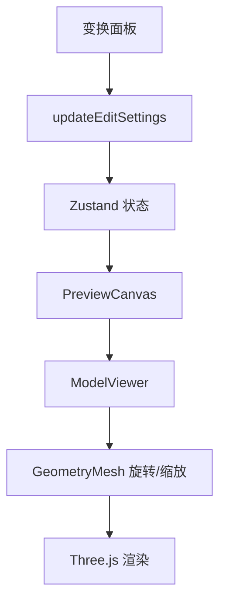

图表来源
- [TransformPanel.tsx:29-101](file://src/components/Edit/TransformPanel.tsx#L29-L101)
- [useAppStore.ts:174-177](file://src/store/useAppStore.ts#L174-L177)
- [ModelViewer.tsx:65-69](file://src/components/Shared/ModelViewer.tsx#L65-L69)

章节来源
- [TransformPanel.tsx:29-101](file://src/components/Edit/TransformPanel.tsx#L29-L101)
- [ModelViewer.tsx:65-69](file://src/components/Shared/ModelViewer.tsx#L65-L69)

### 响应式设计与视图模式
- 视图模式：简单模式与专业模式，分别对应不同的布局比例与可见信息。
- 简单模式：左侧画布占比更大，右侧参数面板折叠或最小化。
- 专业模式：右侧参数面板完全展开，显示更多技术细节与高级参数。
- 切换逻辑：通过全局状态 viewMode 控制，编辑视图根据模式调整布局。

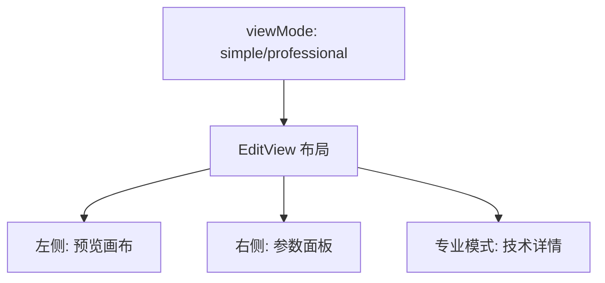

图表来源
- [EditView.tsx:10-26](file://src/components/Edit/EditView.tsx#L10-L26)
- [useAppStore.ts:78-84](file://src/store/useAppStore.ts#L78-L84)

章节来源
- [EditView.tsx:10-26](file://src/components/Edit/EditView.tsx#L10-L26)
- [useAppStore.ts:78-84](file://src/store/useAppStore.ts#L78-L84)

### 数据流与状态管理
- 全局状态：Zustand 提供 editSettings（材质、旋转、缩放、光照、背景）与 viewMode 等。
- 订阅持久化：用户资料与模板持久化到本地存储。
- 面板联动：材质、光照、变换面板通过 updateEditSettings 修改状态，触发画布重渲染。
- 默认值：使用 mockData 中的 defaultEditSettings 初始化。

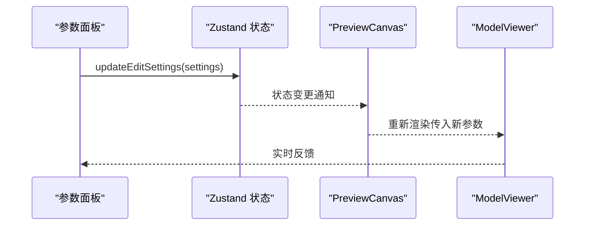

图表来源
- [useAppStore.ts:174-177](file://src/store/useAppStore.ts#L174-L177)
- [mockData.ts:14-27](file://src/utils/mockData.ts#L14-L27)

章节来源
- [useAppStore.ts:174-177](file://src/store/useAppStore.ts#L174-L177)
- [mockData.ts:14-27](file://src/utils/mockData.ts#L14-L27)

## 依赖关系分析
- 依赖库：React、Three.js、@react-three/fiber、@react-three/drei、Framer Motion、Lucide Icons、clsx。
- 关键依赖作用：
  - @react-three/fiber：将 Three.js 以声明式方式接入 React。
  - @react-three/drei：提供 OrbitControls、Environment、Grid 等常用工具。
  - Zustand：轻量状态管理，集中管理编辑设置与用户偏好。

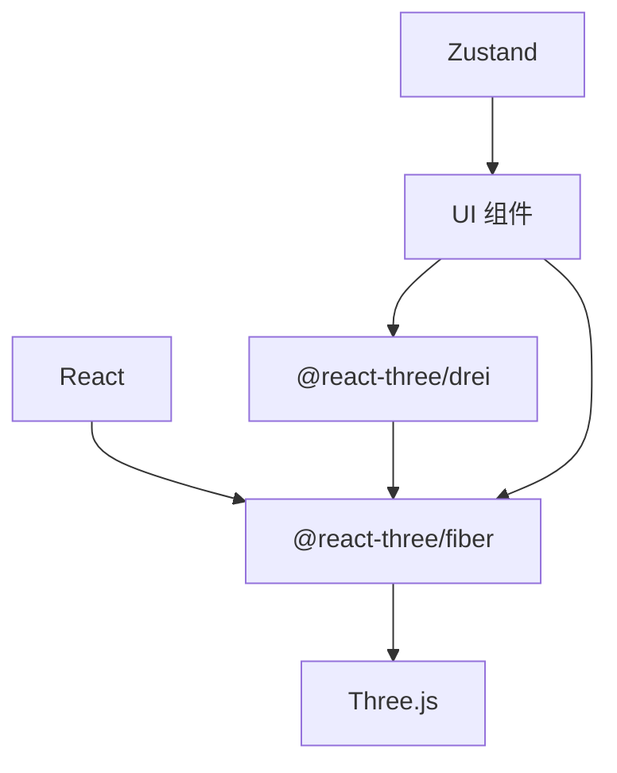

图表来源
- [package.json:11-22](file://package.json#L11-L22)
- [ModelViewer.tsx:1-4](file://src/components/Shared/ModelViewer.tsx#L1-L4)

章节来源
- [package.json:11-22](file://package.json#L11-L22)

## 性能考量
- 渲染优化
  - 抗锯齿与透明背景：Canvas 启用抗锯齿与透明背景，提升视觉质量。
  - 网格与环境贴图：在非紧凑模式下启用网格与环境贴图，专业模式下可按需开启。
  - 自动旋转：仅在需要时启用，避免不必要的帧更新。
- 相机与控制器
  - 缩放与平移：在非紧凑模式下启用，减少不必要的交互开销。
  - 相机视野：根据紧凑模式调整 FOV，平衡可视范围与性能。
- 内存管理
  - 使用 React.memo 包装 ModelViewer，减少不必要重渲染。
  - 使用 Suspense 加载场景，避免阻塞主线程。
- LOD 技术与帧率控制
  - 当前实现未显式使用 LOD，可在复杂模型场景引入多级细节（LOD）与动态分辨率策略。
  - 帧率控制：可通过 requestAnimationFrame 的节流与渲染频率限制，结合设备性能动态调整。
- 最佳实践
  - 合理拆分几何体与材质，避免一次性加载过多纹理。
  - 使用缓存与懒加载策略，减少首次渲染压力。
  - 在低端设备上关闭环境贴图与网格，提升帧率稳定性。

[本节为通用性能指导，不直接分析具体文件，故不附加章节来源]

## 故障排查指南
- 画布不显示或空白
  - 检查 Canvas 是否正确挂载与尺寸是否有效。
  - 确认 Suspense fallback 是否被意外隐藏。
- 相机控制异常
  - 确认轨道控制器在非紧凑模式下启用缩放与平移。
  - 检查相机位置与视野设置是否合理。
- 材质不生效
  - 确认材质参数（颜色、金属度、粗糙度、自发光）已通过全局状态更新。
  - 检查材质节点是否正确渲染。
- 视图模式切换无效
  - 确认全局状态 viewMode 已更新，编辑视图根据模式调整布局。
- 性能问题
  - 关闭环境贴图与网格，降低渲染负载。
  - 减少纹理分辨率或关闭自发光等高成本效果。

章节来源
- [ModelViewer.tsx:140-152](file://src/components/Shared/ModelViewer.tsx#L140-L152)
- [ModelViewer.tsx:119-123](file://src/components/Shared/ModelViewer.tsx#L119-L123)
- [EditView.tsx:10-26](file://src/components/Edit/EditView.tsx#L10-L26)

## 结论
预览画布通过清晰的容器-展示分离与全局状态驱动，实现了流畅的 3D 模型预览体验。Three.js 与 @react-three/fiber 的组合提供了简洁的声明式渲染能力，轨道控制器满足常见的交互需求。配合材质、光照与变换面板，用户可以在简单与专业两种视图模式下高效完成模型编辑与审阅。未来可在复杂场景引入 LOD、动态分辨率与帧率控制等策略，进一步提升性能与用户体验。

## 附录
- 类型定义：EditSettings、MaterialSettings、ViewMode 等类型定义支撑全局状态结构。
- 默认值：defaultEditSettings 提供初始材质与变换参数，确保首次渲染一致性。

章节来源
- [index.ts:93-99](file://src/types/index.ts#L93-L99)
- [mockData.ts:14-27](file://src/utils/mockData.ts#L14-L27)