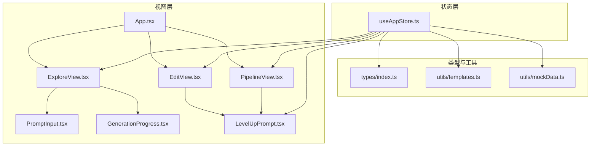
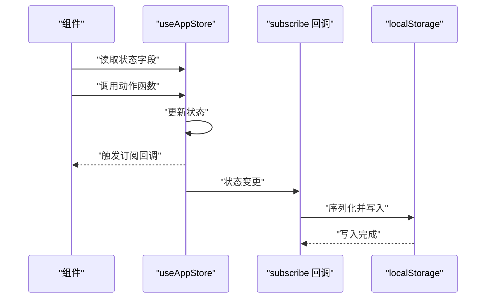
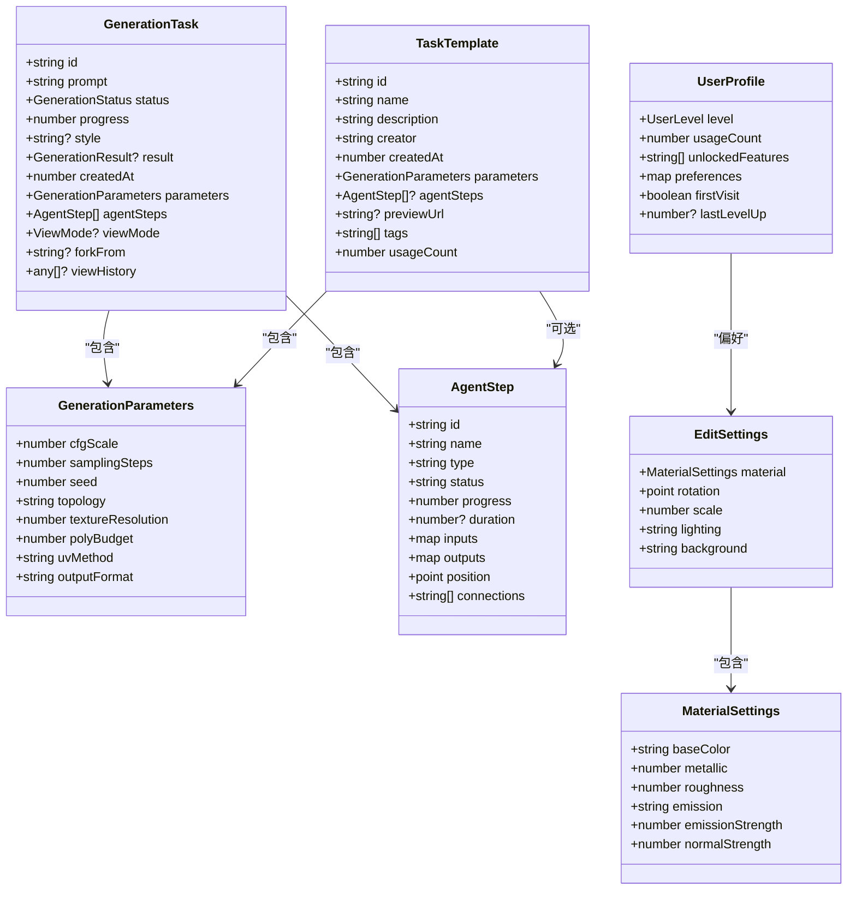
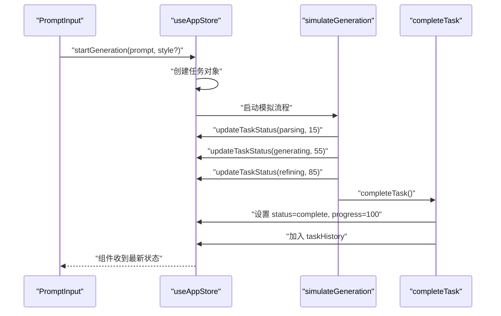
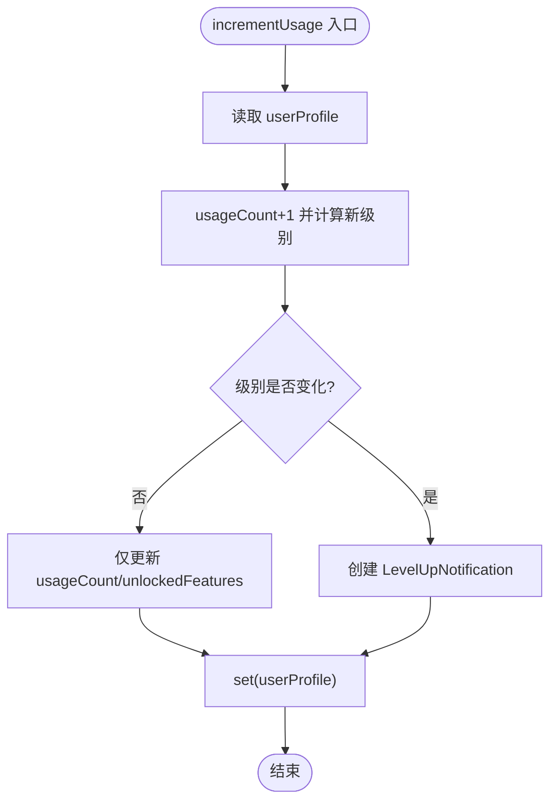
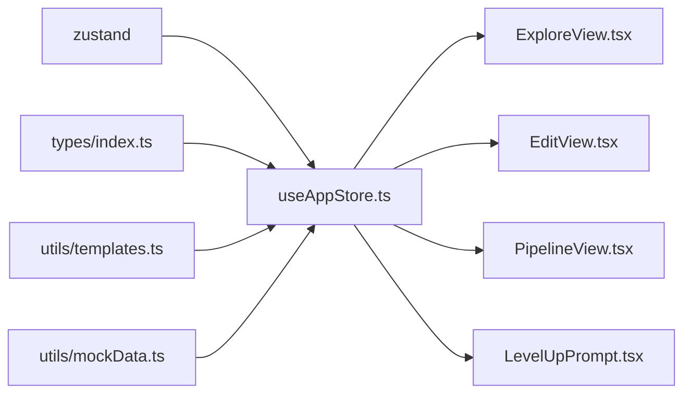

# 状态管理

<cite>
**本文引用的文件列表**
- [useAppStore.ts](file://src/store/useAppStore.ts)
- [index.ts](file://src/types/index.ts)
- [templates.ts](file://src/utils/templates.ts)
- [mockData.ts](file://src/utils/mockData.ts)
- [ExploreView.tsx](file://src/components/Explore/ExploreView.tsx)
- [PromptInput.tsx](file://src/components/Explore/PromptInput.tsx)
- [GenerationProgress.tsx](file://src/components/Explore/GenerationProgress.tsx)
- [EditView.tsx](file://src/components/Edit/EditView.tsx)
- [PipelineView.tsx](file://src/components/Pipeline/PipelineView.tsx)
- [LevelUpPrompt.tsx](file://src/components/Shared/LevelUpPrompt.tsx)
- [App.tsx](file://src/App.tsx)
- [package.json](file://package.json)
</cite>

## 目录
1. [简介](#简介)
2. [项目结构](#项目结构)
3. [核心组件](#核心组件)
4. [架构总览](#架构总览)
5. [详细组件分析](#详细组件分析)
6. [依赖关系分析](#依赖关系分析)
7. [性能考量](#性能考量)
8. [故障排查指南](#故障排查指南)
9. [结论](#结论)
10. [附录](#附录)

## 简介
本文件围绕 Zustand 状态管理在 3D 模型生成应用中的设计与实现进行系统化说明，重点覆盖：
- useAppStore 的状态结构、动作函数与中间件使用
- 用户配置管理、生成任务状态、编辑设置管理、模板系统
- 状态持久化与本地存储策略
- 状态订阅与组件更新机制
- 最佳实践、性能优化建议、调试与开发工具使用
- 状态迁移与版本兼容性处理

## 项目结构
该应用采用按功能域划分的目录组织，状态管理集中在 store/useAppStore.ts，类型定义位于 types/index.ts，模板工具位于 utils/templates.ts，模拟数据位于 utils/mockData.ts。组件层通过 useAppStore 订阅状态并在 UI 中响应变化。

图表来源
- [useAppStore.ts:100-311](file://src/store/useAppStore.ts#L100-L311)
- [index.ts:1-160](file://src/types/index.ts#L1-L160)
- [templates.ts:1-115](file://src/utils/templates.ts#L1-L115)
- [mockData.ts:1-189](file://src/utils/mockData.ts#L1-L189)
- [App.tsx:10-32](file://src/App.tsx#L10-L32)
- [ExploreView.tsx:11-262](file://src/components/Explore/ExploreView.tsx#L11-L262)
- [PromptInput.tsx:8-160](file://src/components/Explore/PromptInput.tsx#L8-L160)
- [GenerationProgress.tsx:13-130](file://src/components/Explore/GenerationProgress.tsx#L13-L130)
- [EditView.tsx:9-158](file://src/components/Edit/EditView.tsx#L9-L158)
- [PipelineView.tsx:9-167](file://src/components/Pipeline/PipelineView.tsx#L9-L167)
- [LevelUpPrompt.tsx:7-127](file://src/components/Shared/LevelUpPrompt.tsx#L7-L127)

章节来源
- [useAppStore.ts:100-311](file://src/store/useAppStore.ts#L100-L311)
- [App.tsx:10-32](file://src/App.tsx#L10-L32)

## 核心组件
本节聚焦 useAppStore 的状态结构与动作函数，涵盖以下关键领域：
- 应用模式与 UI 控制：mode、sidebarOpen、toggleSidebar
- 生成任务生命周期：currentTask、taskHistory、startGeneration、updateTaskStatus、completeTask
- 编辑设置：editSettings、updateEditSettings
- 节点选择：selectedNode、setSelectedNode
- 用户档案与等级系统：userProfile、viewMode、setViewMode、incrementUsage、unlockFeature、checkLevelUp、setUserLevel、dismissFirstVisit
- 模板系统：templates、addTemplate、removeTemplate、updateTemplate
- 意图分析与等级提升通知：intentAnalysis、setIntentAnalysis、levelUpNotification、setLevelUpNotification、dismissLevelUpNotification

章节来源
- [useAppStore.ts:50-98](file://src/store/useAppStore.ts#L50-L98)
- [useAppStore.ts:100-311](file://src/store/useAppStore.ts#L100-L311)

## 架构总览
useAppStore 使用 Zustand 的 create API 定义全局状态与动作，内部通过 subscribe 实现状态持久化；同时包含一个内部辅助函数用于模拟生成流程。组件通过 useAppStore 订阅所需字段，实现细粒度的 UI 更新。

图表来源
- [useAppStore.ts:313-325](file://src/store/useAppStore.ts#L313-L325)

章节来源
- [useAppStore.ts:313-325](file://src/store/useAppStore.ts#L313-L325)

## 详细组件分析

### 状态结构与类型定义
- 应用模式与视图模式：AppMode、ViewMode
- 生成任务：GenerationTask、GenerationStatus、GenerationResult、GenerationParameters、AgentStep
- 用户档案与等级：UserProfile、UserLevel、LevelUpNotification
- 模板系统：TaskTemplate
- 编辑设置：EditSettings、MaterialSettings

图表来源
- [index.ts:13-138](file://src/types/index.ts#L13-L138)
- [index.ts:93-99](file://src/types/index.ts#L93-L99)
- [index.ts:84-91](file://src/types/index.ts#L84-L91)

章节来源
- [index.ts:1-160](file://src/types/index.ts#L1-L160)

### 动作函数与生成流程
- 启动生成：startGeneration 创建任务并启动模拟进度
- 更新状态：updateTaskStatus 设置任务状态与进度
- 完成任务：completeTask 将任务标记为完成并加入历史
- 模拟生成：simulateGeneration 以阶段推进任务状态与步骤进度

图表来源
- [useAppStore.ts:107-158](file://src/store/useAppStore.ts#L107-L158)
- [useAppStore.ts:327-367](file://src/store/useAppStore.ts#L327-L367)

章节来源
- [useAppStore.ts:107-158](file://src/store/useAppStore.ts#L107-L158)
- [useAppStore.ts:327-367](file://src/store/useAppStore.ts#L327-L367)

### 用户配置管理与等级系统
- 用户档案加载：loadUserProfile 从 localStorage 初始化或恢复
- 视图模式：setViewMode 切换 simple/professional
- 使用计数与等级：incrementUsage 根据阈值自动升级并生成等级提升通知
- 特性解锁：unlockFeature 手动解锁特性
- 等级检查：checkLevelUp 返回即将解锁的提示
- 强制设置等级：setUserLevel 用于演示或重置
- 首次访问：dismissFirstVisit 清除首次访问标记

图表来源
- [useAppStore.ts:177-215](file://src/store/useAppStore.ts#L177-L215)

章节来源
- [useAppStore.ts:171-284](file://src/store/useAppStore.ts#L171-L284)

### 编辑设置管理
- 默认编辑设置：defaultEditSettings 来自 mockData
- 更新编辑设置：updateEditSettings 支持部分更新，确保浅合并不丢失未更新字段
- 组件使用：EditView 通过 updateEditSettings 实时更新材质、旋转、缩放等

章节来源
- [useAppStore.ts:160-163](file://src/store/useAppStore.ts#L160-L163)
- [mockData.ts:14-27](file://src/utils/mockData.ts#L14-L27)
- [EditView.tsx:10-158](file://src/components/Edit/EditView.tsx#L10-L158)

### 模板系统
- 模板创建：createTemplateFromTask 从当前任务抽取参数与步骤
- 模板应用：applyTemplate 从模板生成参数（含可选 agentSteps）
- 预置模板：DEFAULT_TEMPLATES 提供系统默认模板
- 模板搜索：filterTemplates 支持名称/描述/标签模糊匹配
- 模板持久化：templates 字段通过 subscribe 写入 localStorage

章节来源
- [templates.ts:4-43](file://src/utils/templates.ts#L4-L43)
- [templates.ts:25-33](file://src/utils/templates.ts#L25-L33)
- [templates.ts:46-104](file://src/utils/templates.ts#L46-L104)
- [templates.ts:107-114](file://src/utils/templates.ts#L107-L114)
- [useAppStore.ts:286-301](file://src/store/useAppStore.ts#L286-L301)
- [useAppStore.ts:313-325](file://src/store/useAppStore.ts#L313-L325)

### 意图分析与智能建议
- PromptInput 在输入时进行去抖分析，结合用户档案与用户级别给出建议
- setIntentAnalysis 存储分析结果，支持切换视图模式与应用模式
- LevelUpPrompt 展示等级提升通知并提供一键跳转

章节来源
- [PromptInput.tsx:13-82](file://src/components/Explore/PromptInput.tsx#L13-L82)
- [PromptInput.tsx:137-144](file://src/components/Explore/PromptInput.tsx#L137-L144)
- [LevelUpPrompt.tsx:7-44](file://src/components/Shared/LevelUpPrompt.tsx#L7-L44)
- [useAppStore.ts:303-310](file://src/store/useAppStore.ts#L303-L310)

### 状态订阅与组件更新机制
- subscribe 回调监听 userProfile 与 templates 的变更，分别写入 localStorage
- 组件通过 useAppStore 订阅所需字段，实现细粒度更新
- App 根据 mode 渲染 Explore/Edit/Pipeline 三个视图

章节来源
- [useAppStore.ts:313-325](file://src/store/useAppStore.ts#L313-L325)
- [App.tsx:10-32](file://src/App.tsx#L10-L32)
- [ExploreView.tsx:12-24](file://src/components/Explore/ExploreView.tsx#L12-L24)
- [EditView.tsx:10-11](file://src/components/Edit/EditView.tsx#L10-L11)
- [PipelineView.tsx:10-12](file://src/components/Pipeline/PipelineView.tsx#L10-L12)

## 依赖关系分析
- 外部依赖：zustand 作为状态库，three/@react-three/* 用于 3D 渲染
- 内部依赖：types 定义数据模型；templates 提供模板工具；mockData 提供默认参数与编辑设置
- 组件依赖：各视图组件通过 useAppStore 访问状态与动作

图表来源
- [package.json:11-21](file://package.json#L11-L21)
- [useAppStore.ts:100-311](file://src/store/useAppStore.ts#L100-L311)
- [index.ts:1-160](file://src/types/index.ts#L1-L160)
- [templates.ts:1-115](file://src/utils/templates.ts#L1-L115)
- [mockData.ts:1-189](file://src/utils/mockData.ts#L1-L189)

章节来源
- [package.json:11-21](file://package.json#L11-L21)

## 性能考量
- 细粒度订阅：组件仅订阅所需字段，避免不必要的重渲染
- 浅合并更新：updateEditSettings 使用浅合并，减少深层对象复制开销
- 去抖处理：PromptInput 对意图分析使用去抖，降低频繁计算
- 模拟生成：simulateGeneration 使用定时器分阶段推进，避免阻塞主线程
- 本地存储：subscribe 仅在状态变更时写入，避免频繁 IO

[本节为通用性能建议，无需特定文件引用]

## 故障排查指南
- 状态未持久化
  - 检查 subscribe 回调是否执行，确认 localStorage 是否抛出异常
  - 章节来源: [useAppStore.ts:313-325](file://src/store/useAppStore.ts#L313-L325)
- 生成流程不更新
  - 确认 startGeneration 已被调用且 currentTask 存在
  - 检查 simulateGeneration 的定时器是否仍在运行
  - 章节来源: [useAppStore.ts:107-158](file://src/store/useAppStore.ts#L107-L158), [useAppStore.ts:327-367](file://src/store/useAppStore.ts#L327-L367)
- 编辑设置未生效
  - 确认 updateEditSettings 接收的是 Partial<EditSettings>，避免遗漏字段
  - 章节来源: [useAppStore.ts:160-163](file://src/store/useAppStore.ts#L160-L163)
- 模板无法保存/加载
  - 检查 localStorage 键名与 JSON 序列化/反序列化逻辑
  - 章节来源: [useAppStore.ts:18-19](file://src/store/useAppStore.ts#L18-L19), [useAppStore.ts:42-48](file://src/store/useAppStore.ts#L42-L48), [useAppStore.ts:286-301](file://src/store/useAppStore.ts#L286-L301)

## 结论
useAppStore 以清晰的状态结构与动作函数实现了完整的 3D 模型生成应用状态管理，配合模板系统、意图分析与等级体系，提供了良好的用户体验。通过 subscribe 实现的本地存储与组件细粒度订阅，保证了状态的一致性与性能。后续可在模板版本控制、状态调试与迁移方面进一步增强。

[本节为总结性内容，无需特定文件引用]

## 附录

### 状态持久化与本地存储策略
- 用户档案键：USER_PROFILE_KEY
- 模板键：TEMPLATES_KEY
- 加载策略：初次加载失败时回退到默认值
- 写入策略：状态变更时异步写入，异常安全

章节来源
- [useAppStore.ts:17-19](file://src/store/useAppStore.ts#L17-L19)
- [useAppStore.ts:34-48](file://src/store/useAppStore.ts#L34-L48)
- [useAppStore.ts:313-325](file://src/store/useAppStore.ts#L313-L325)

### 状态调试与开发工具
- 建议使用 React DevTools 与 Zustand Devtools 进行状态追踪
- 可在 subscribe 回调中添加日志，观察持久化时机
- 对复杂动作（如生成流程）可拆分为更小单元以便测试

[本节为通用建议，无需特定文件引用]

### 状态迁移与版本兼容性
- 当前未实现显式迁移逻辑，建议未来引入版本号字段与迁移函数
- 模板系统可扩展版本字段，以支持向后兼容与降级处理
- 用户档案可增加 schemaVersion 字段，配合迁移函数处理字段变更

[本节为通用建议，无需特定文件引用]