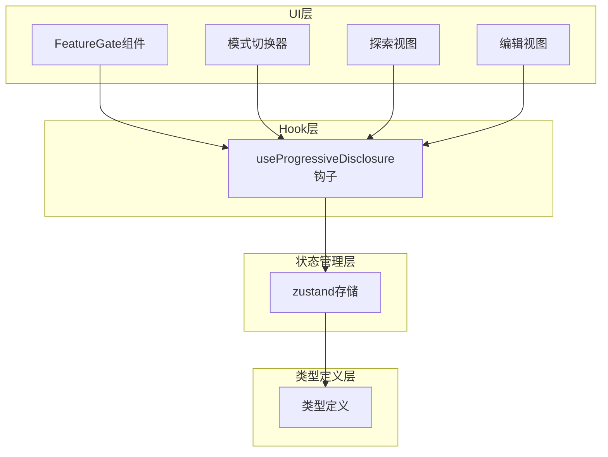
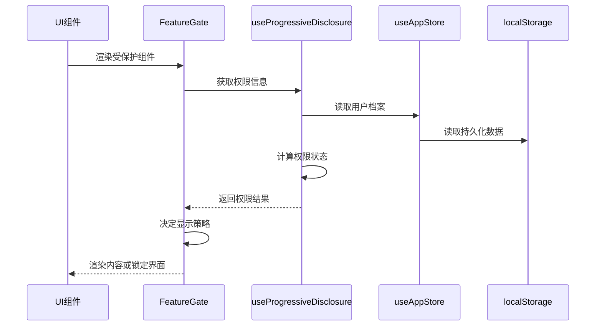
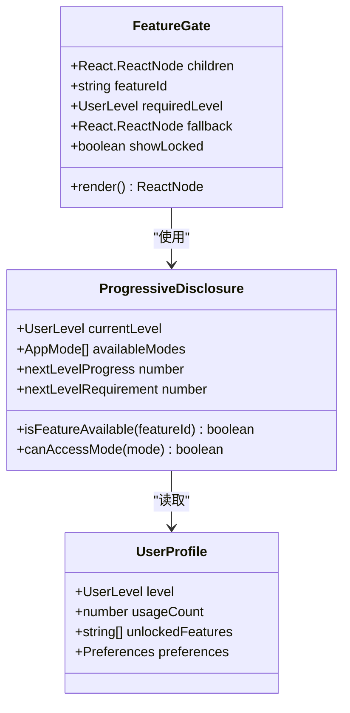
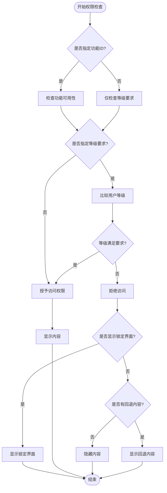
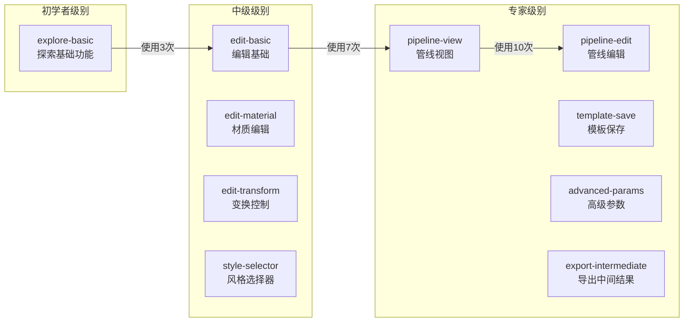
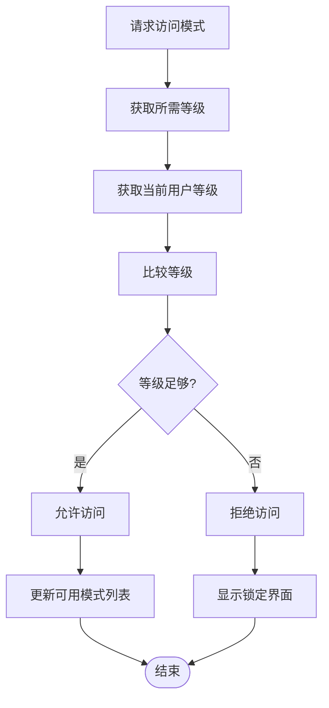
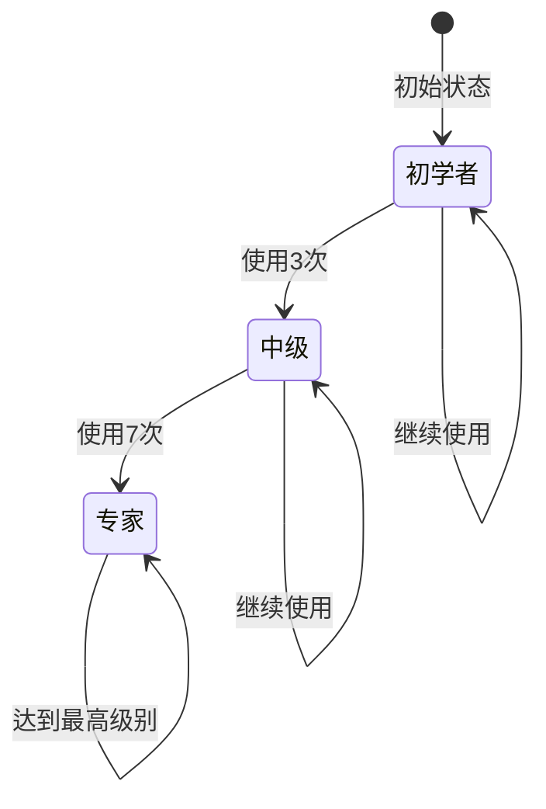
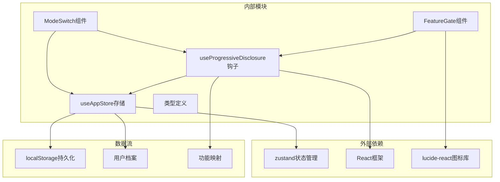

# 功能门控系统

<cite>
**本文档引用的文件**
- [FeatureGate.tsx](file://src/components/Shared/FeatureGate.tsx)
- [useProgressiveDisclosure.ts](file://src/hooks/useProgressiveDisclosure.ts)
- [useAppStore.ts](file://src/store/useAppStore.ts)
- [index.ts](file://src/types/index.ts)
- [ModeSwitch.tsx](file://src/components/Layout/ModeSwitch.tsx)
- [ExploreView.tsx](file://src/components/Explore/ExploreView.tsx)
- [EditView.tsx](file://src/components/Edit/EditView.tsx)
</cite>

## 目录
1. [简介](#简介)
2. [项目结构](#项目结构)
3. [核心组件](#核心组件)
4. [架构概览](#架构概览)
5. [详细组件分析](#详细组件分析)
6. [依赖关系分析](#依赖关系分析)
7. [性能考虑](#性能考虑)
8. [故障排除指南](#故障排除指南)
9. [结论](#结论)
10. [附录](#附录)

## 简介

功能门控系统是本3D模型生成应用中的核心权限控制系统，通过渐进式解锁机制为用户提供从初学者到专家级别的分层功能访问控制。该系统基于用户使用次数和等级制度，实现了智能的功能权限管理和用户体验优化。

系统的核心设计理念是通过渐进式学习曲线，让用户在掌握基础功能后逐步接触更高级的特性，确保学习过程的连贯性和有效性。

## 项目结构

功能门控系统主要分布在以下模块中：

**图表来源**
- [FeatureGate.tsx:1-87](file://src/components/Shared/FeatureGate.tsx#L1-L87)
- [useProgressiveDisclosure.ts:1-136](file://src/hooks/useProgressiveDisclosure.ts#L1-L136)
- [useAppStore.ts:1-368](file://src/store/useAppStore.ts#L1-L368)

**章节来源**
- [FeatureGate.tsx:1-87](file://src/components/Shared/FeatureGate.tsx#L1-L87)
- [useProgressiveDisclosure.ts:1-136](file://src/hooks/useProgressiveDisclosure.ts#L1-L136)
- [useAppStore.ts:1-368](file://src/store/useAppStore.ts#L1-L368)

## 核心组件

功能门控系统由三个核心组件构成：

### 1. FeatureGate组件
负责单个功能的权限控制，支持多种验证方式：
- 基于功能ID的特征门控
- 基于用户等级的强制门控
- 锁定状态的可视化反馈

### 2. useProgressiveDisclosure钩子
提供完整的权限控制逻辑和状态管理：
- 功能可用性检查
- 模式访问控制
- 可用模式列表
- 等级进度计算

### 3. 用户档案管理
通过zustand状态管理实现用户数据持久化：
- 等级状态跟踪
- 功能解锁记录
- 使用计数统计

**章节来源**
- [FeatureGate.tsx:22-87](file://src/components/Shared/FeatureGate.tsx#L22-L87)
- [useProgressiveDisclosure.ts:48-135](file://src/hooks/useProgressiveDisclosure.ts#L48-L135)
- [useAppStore.ts:100-311](file://src/store/useAppStore.ts#L100-L311)

## 架构概览

**图表来源**
- [FeatureGate.tsx:30-86](file://src/components/Shared/FeatureGate.tsx#L30-L86)
- [useProgressiveDisclosure.ts:60-135](file://src/hooks/useProgressiveDisclosure.ts#L60-L135)
- [useAppStore.ts:34-48](file://src/store/useAppStore.ts#L34-L48)

系统采用分层架构设计，确保权限控制逻辑与UI渲染分离，提高代码的可维护性和可测试性。

## 详细组件分析

### FeatureGate组件分析

FeatureGate是功能门控系统的核心UI组件，实现了灵活的权限控制机制：

**图表来源**
- [FeatureGate.tsx:22-87](file://src/components/Shared/FeatureGate.tsx#L22-L87)
- [useProgressiveDisclosure.ts:48-135](file://src/hooks/useProgressiveDisclosure.ts#L48-L135)
- [index.ts:105-116](file://src/types/index.ts#L105-L116)

#### 权限检查流程

**图表来源**
- [FeatureGate.tsx:30-86](file://src/components/Shared/FeatureGate.tsx#L30-L86)

**章节来源**
- [FeatureGate.tsx:30-86](file://src/components/Shared/FeatureGate.tsx#L30-L86)

### useProgressiveDisclosure钩子分析

该钩子提供了完整的权限控制逻辑，包括功能映射表、模式访问控制和等级进度计算：

#### FEATURE_LEVEL_MAP功能映射表

**图表来源**
- [useProgressiveDisclosure.ts:6-17](file://src/hooks/useProgressiveDisclosure.ts#L6-L17)

#### 模式访问控制机制

**图表来源**
- [useProgressiveDisclosure.ts:71-76](file://src/hooks/useProgressiveDisclosure.ts#L71-L76)

**章节来源**
- [useProgressiveDisclosure.ts:6-42](file://src/hooks/useProgressiveDisclosure.ts#L6-L42)
- [useProgressiveDisclosure.ts:71-76](file://src/hooks/useProgressiveDisclosure.ts#L71-L76)

### 用户档案管理系统

用户档案通过zustand状态管理实现，包含完整的权限状态跟踪：

#### 等级升级机制

**图表来源**
- [useAppStore.ts:177-215](file://src/store/useAppStore.ts#L177-L215)

**章节来源**
- [useAppStore.ts:177-215](file://src/store/useAppStore.ts#L177-L215)

## 依赖关系分析

**图表来源**
- [FeatureGate.tsx:1-5](file://src/components/Shared/FeatureGate.tsx#L1-L5)
- [useProgressiveDisclosure.ts:1-3](file://src/hooks/useProgressiveDisclosure.ts#L1-L3)
- [useAppStore.ts:1-15](file://src/store/useAppStore.ts#L1-L15)

**章节来源**
- [FeatureGate.tsx:1-5](file://src/components/Shared/FeatureGate.tsx#L1-L5)
- [useProgressiveDisclosure.ts:1-3](file://src/hooks/useProgressiveDisclosure.ts#L1-L3)
- [useAppStore.ts:1-15](file://src/store/useAppStore.ts#L1-L15)

## 性能考虑

### 优化策略

1. **Memoization优化**
   - 使用`useMemo`缓存权限计算结果
   - 避免不必要的重新渲染
   - 减少状态变更时的计算开销

2. **条件渲染**
   - 仅在需要时显示锁定界面
   - 避免在无权限情况下进行复杂计算

3. **状态分离**
   - 将权限状态与业务状态分离
   - 提高组件的独立性和可测试性

### 性能指标

- **权限检查时间**: O(1) - 基于哈希表查找
- **状态更新**: 增量更新，避免全量重渲染
- **内存占用**: 最小化，仅存储必要状态

**章节来源**
- [useProgressiveDisclosure.ts:67-76](file://src/hooks/useProgressiveDisclosure.ts#L67-L76)
- [FeatureGate.tsx:37-48](file://src/components/Shared/FeatureGate.tsx#L37-L48)

## 故障排除指南

### 常见问题及解决方案

#### 1. 功能无法解锁
**症状**: 用户达到使用次数但功能仍不可用
**原因**: `unlockedFeatures`数组未正确更新
**解决**: 检查`incrementUsage`方法的状态更新逻辑

#### 2. 等级显示异常
**症状**: 等级进度条不正确
**原因**: `nextLevelProgress`计算错误
**解决**: 验证`LEVEL_THRESHOLDS`映射表的正确性

#### 3. 模式切换失效
**症状**: 模式按钮始终显示锁定状态
**原因**: `availableModes`计算错误
**解决**: 检查`LEVEL_MODES`映射表和`canAccessMode`逻辑

**章节来源**
- [useAppStore.ts:177-215](file://src/store/useAppStore.ts#L177-L215)
- [useProgressiveDisclosure.ts:96-113](file://src/hooks/useProgressiveDisclosure.ts#L96-L113)

## 结论

功能门控系统通过精心设计的渐进式权限控制机制，为用户提供了流畅的学习体验。系统的核心优势包括：

1. **清晰的学习路径**: 从基础功能到高级特性的有序解锁
2. **灵活的权限控制**: 支持多种验证方式和自定义规则
3. **优秀的用户体验**: 智能的锁定界面和进度提示
4. **可扩展的架构**: 易于添加新功能和修改权限规则

该系统为类似的应用程序提供了良好的参考模型，展示了如何通过权限控制提升用户体验和产品价值。

## 附录

### 实际应用场景

#### 探索模式权限控制
在探索模式中，所有基础功能默认开放，用户可以通过使用次数解锁更高级别的功能。

#### 编辑模式权限控制
编辑模式包含多个子功能面板，每个面板都有相应的权限要求，确保用户逐步掌握复杂的编辑工具。

#### 管线模式权限控制
管线模式作为最高级别的功能，仅对专家用户开放，提供完整的AI生成流程控制能力。

### 扩展指南

#### 添加新功能门控规则
1. 在`FEATURE_LEVEL_MAP`中添加功能ID和对应等级
2. 更新`LEVEL_UNLOCK_MAP`以定义升级时解锁的新功能
3. 在相应组件中使用`FeatureGate`组件包装受保护内容

#### 自定义权限验证
1. 修改`isFeatureAvailable`函数以支持更复杂的验证逻辑
2. 扩展`FeatureGateProps`接口以支持新的验证参数
3. 更新`useProgressiveDisclosure`钩子以处理新的权限类型

**章节来源**
- [useProgressiveDisclosure.ts:6-42](file://src/hooks/useProgressiveDisclosure.ts#L6-L42)
- [FeatureGate.tsx:22-28](file://src/components/Shared/FeatureGate.tsx#L22-L28)