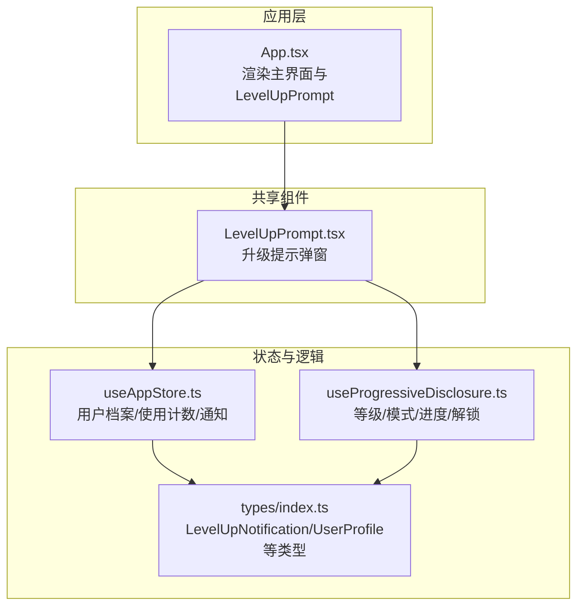
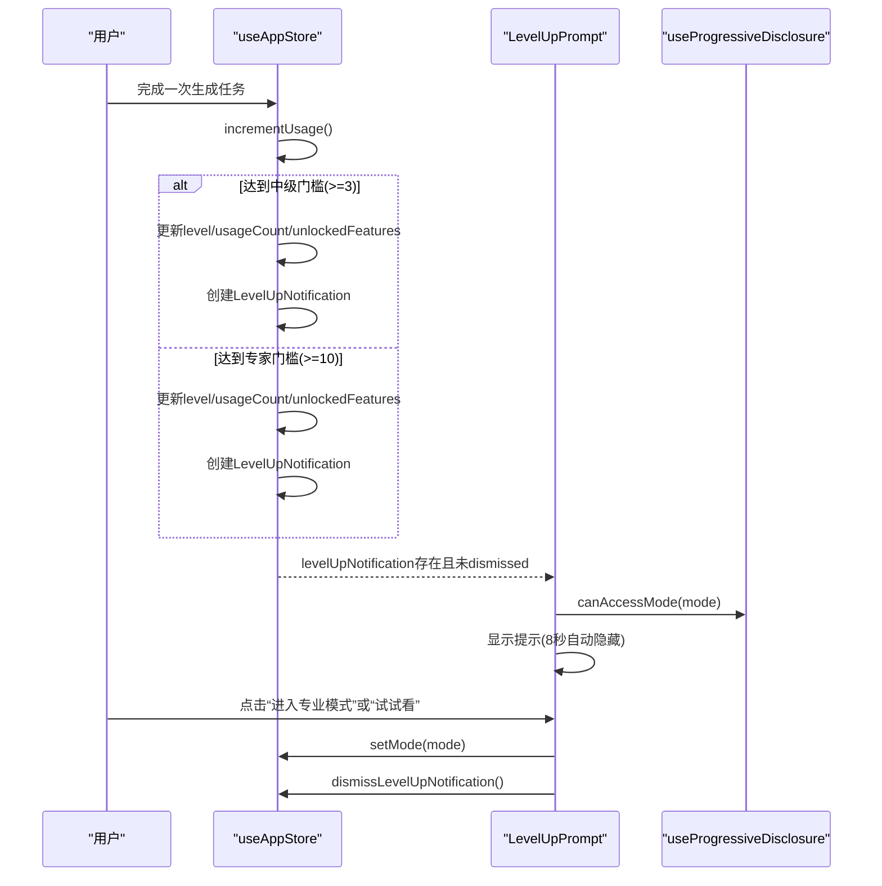
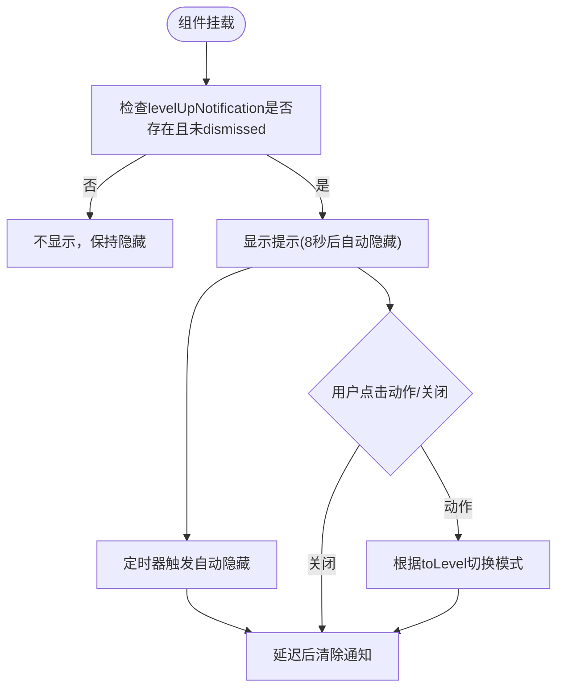
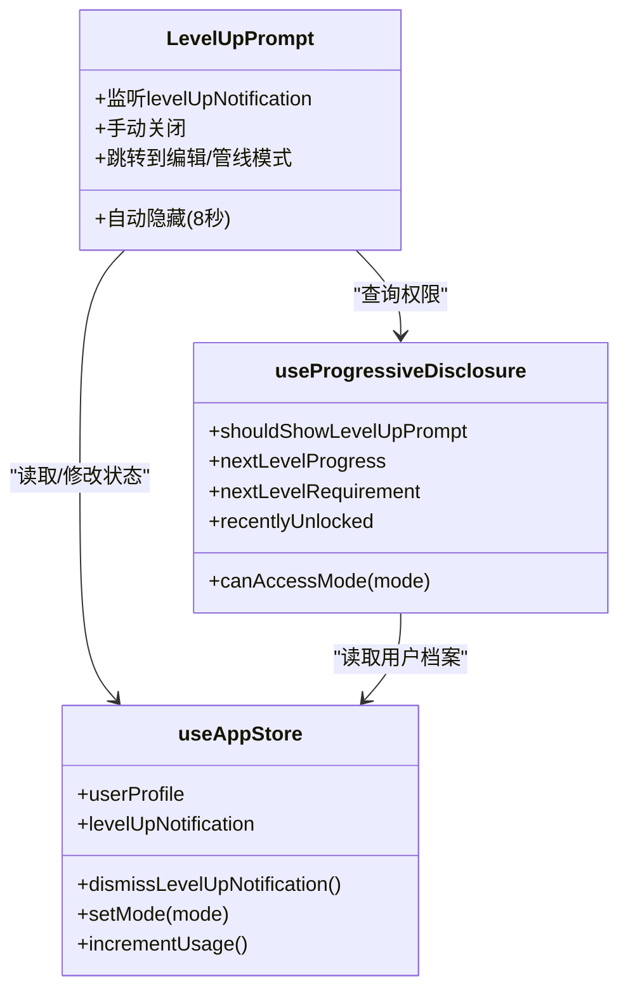

# 升级提示系统

<cite>
**本文引用的文件列表**
- [LevelUpPrompt.tsx](file://src/components/Shared/LevelUpPrompt.tsx)
- [useProgressiveDisclosure.ts](file://src/hooks/useProgressiveDisclosure.ts)
- [useAppStore.ts](file://src/store/useAppStore.ts)
- [index.ts](file://src/types/index.ts)
- [App.tsx](file://src/App.tsx)
- [PromptInput.tsx](file://src/components/Explore/PromptInput.tsx)
</cite>

## 目录
1. [简介](#简介)
2. [项目结构与定位](#项目结构与定位)
3. [核心组件与职责](#核心组件与职责)
4. [架构总览](#架构总览)
5. [详细组件解析](#详细组件解析)
6. [依赖关系分析](#依赖关系分析)
7. [性能与可用性考量](#性能与可用性考量)
8. [故障排查指南](#故障排查指南)
9. [结论](#结论)
10. [附录：可定制化建议](#附录可定制化建议)

## 简介
本文件系统性地解析“升级提示系统”，围绕 LevelUpPrompt 组件的触发机制、显示逻辑、shouldShowLevelUpPrompt 的判断条件与时间窗口控制、nextLevelProgress 进度计算与 nextLevelRequirement 阈值显示，以及 recentlyUnlocked 最近解锁功能的展示逻辑展开，并提供用户体验设计原则、交互效果说明及自定义提示内容与视觉样式的实践建议。

## 项目结构与定位
- LevelUpPrompt 是一个全局共享的提示组件，位于 Shared 目录，用于在用户达到特定使用次数门槛时，提示其已升级并解锁新功能。
- 该组件通过 useProgressiveDisclosure 提供的 shouldShowLevelUpPrompt、nextLevelProgress、nextLevelRequirement、recentlyUnlocked 等能力，结合 useAppStore 中的 levelUpNotification 状态驱动显示与交互。
- 在应用入口 App.tsx 中直接渲染 LevelUpPrompt，确保在任意模式下均能正确展示。

图表来源
- [App.tsx:10-32](file://src/App.tsx#L10-L32)
- [LevelUpPrompt.tsx:7-46](file://src/components/Shared/LevelUpPrompt.tsx#L7-L46)
- [useAppStore.ts:100-311](file://src/store/useAppStore.ts#L100-L311)
- [useProgressiveDisclosure.ts:60-135](file://src/hooks/useProgressiveDisclosure.ts#L60-L135)
- [index.ts:101-159](file://src/types/index.ts#L101-L159)

章节来源
- [App.tsx:10-32](file://src/App.tsx#L10-L32)
- [LevelUpPrompt.tsx:7-46](file://src/components/Shared/LevelUpPrompt.tsx#L7-L46)
- [useAppStore.ts:100-311](file://src/store/useAppStore.ts#L100-L311)
- [useProgressiveDisclosure.ts:60-135](file://src/hooks/useProgressiveDisclosure.ts#L60-L135)
- [index.ts:101-159](file://src/types/index.ts#L101-L159)

## 核心组件与职责
- LevelUpPrompt
  - 负责监听 levelUpNotification 并在满足条件时显示升级提示卡片；内置自动隐藏（8 秒）、手动关闭、跳转到对应模式（编辑/管线）的功能。
- useProgressiveDisclosure
  - 提供 shouldShowLevelUpPrompt 判断、nextLevelProgress 进度计算、nextLevelRequirement 阈值、recentlyUnlocked 解锁列表等能力。
- useAppStore
  - 维护用户档案、使用计数、等级变更、通知状态；在用户使用次数达到阈值时创建 LevelUpNotification，并在任务完成后自动递增使用计数以触发升级。

章节来源
- [LevelUpPrompt.tsx:7-46](file://src/components/Shared/LevelUpPrompt.tsx#L7-L46)
- [useProgressiveDisclosure.ts:60-135](file://src/hooks/useProgressiveDisclosure.ts#L60-L135)
- [useAppStore.ts:177-215](file://src/store/useAppStore.ts#L177-L215)

## 架构总览
升级提示系统的关键流转如下：
- 用户完成一次生成任务后，使用计数 incrementUsage 递增；
- 当使用计数达到门槛（中级 3 次、专家 10 次），更新用户档案并创建 LevelUpNotification；
- LevelUpPrompt 监听该通知并在可见性窗口内显示，支持自动隐藏与手动关闭；
- useProgressiveDisclosure 提供 shouldShowLevelUpPrompt、nextLevelProgress、nextLevelRequirement、recentlyUnlocked 等辅助信息。

图表来源
- [useAppStore.ts:177-215](file://src/store/useAppStore.ts#L177-L215)
- [LevelUpPrompt.tsx:15-44](file://src/components/Shared/LevelUpPrompt.tsx#L15-L44)
- [useProgressiveDisclosure.ts:71-76](file://src/hooks/useProgressiveDisclosure.ts#L71-L76)

## 详细组件解析

### LevelUpPrompt 触发机制与显示逻辑
- 触发条件
  - 当 levelUpNotification 存在且未被 dismiss 时，组件进入可见状态。
  - 组件内部设置 8 秒自动隐藏定时器，随后调用 dismissLevelUpNotification 清除通知。
- 显示逻辑
  - 使用动画库实现从底部滑入、淡入、退出时的滑出与淡出，提升体验。
  - 根据 toLevel 决定文案、图标与按钮样式：中级为“✨”、专家为“🚀”。
- 行为交互
  - 关闭按钮：先隐藏再延迟清除通知，避免闪烁。
  - 动作按钮：若 toLevel 为中级且可访问编辑模式，则切换至编辑模式；若为专家且可访问管线模式，则切换至管线模式。

图表来源
- [LevelUpPrompt.tsx:15-44](file://src/components/Shared/LevelUpPrompt.tsx#L15-L44)

章节来源
- [LevelUpPrompt.tsx:7-46](file://src/components/Shared/LevelUpPrompt.tsx#L7-L46)

### shouldShowLevelUpPrompt 判断条件与时间窗口控制
- 判断条件
  - 当 usageCount 刚好等于中级门槛（3）且当前级别为 beginner，或 usageCount 刚好等于专家门槛（10）且当前级别为 intermediate，应显示提示。
- 时间窗口控制
  - 代码中存在“不要在上次升级后的 5 秒内重复显示”的注释，但实际逻辑以通知的存在作为真实触发条件。因此，只要 levelUpNotification 存在且未被 dismiss，就会显示提示，避免重复显示的策略由通知状态保证。

章节来源
- [useProgressiveDisclosure.ts:80-94](file://src/hooks/useProgressiveDisclosure.ts#L80-L94)

### nextLevelProgress 进度计算与 nextLevelRequirement 阈值显示
- nextLevelProgress
  - 基于当前级别与使用次数，计算到下一级别的进度百分比。若已达最高等级则返回 1。
  - 计算公式：(usageCount - 当前阈值) / (下一阈值 - 当前阈值)，并限制在 [0,1] 区间。
- nextLevelRequirement
  - 返回到达下一等级所需的使用次数阈值；若已达最高等级则返回当前使用次数。

章节来源
- [useProgressiveDisclosure.ts:96-113](file://src/hooks/useProgressiveDisclosure.ts#L96-L113)

### recentlyUnlocked 最近解锁功能展示逻辑
- 数据来源
  - 从 levelUpNotification.unlockedFeatures 获取本次升级解锁的新功能列表。
- 展示方式
  - 组件内部根据 toLevel 判断文案与图标，但未直接展示 recentUnlocked 列表。如需扩展，可在提示卡片中加入“最近解锁”列表区域，遍历 recentlyUnlocked 并映射为简短描述。

章节来源
- [useProgressiveDisclosure.ts:115-118](file://src/hooks/useProgressiveDisclosure.ts#L115-L118)
- [LevelUpPrompt.tsx:88-98](file://src/components/Shared/LevelUpPrompt.tsx#L88-L98)

### 升级提示的用户体验设计原则与交互效果
- 可见性与时机
  - 在用户刚达到升级门槛时立即提示，避免过早或过晚打断。
- 自动隐藏与手动关闭
  - 8 秒自动隐藏，同时允许用户随时关闭，尊重用户控制权。
- 动效与反馈
  - 使用弹簧动画从底部滑入，增强出现感；关闭时平滑过渡，避免突兀。
- 交互路径
  - “进入专业模式/试试看”按钮直接引导用户进入新功能，降低认知负担。
- 文案与视觉
  - 中级与专家采用不同图标与配色，强化层级差异；文案简洁明确，突出解锁内容。

章节来源
- [LevelUpPrompt.tsx:54-120](file://src/components/Shared/LevelUpPrompt.tsx#L54-L120)

### 如何自定义提示内容与视觉样式
- 自定义提示内容
  - 修改 LevelUpPrompt 中的文案与图标映射，按 toLevel 分支输出不同文案。
  - 若需要展示 recentUnlocked 列表，可在卡片中新增区域，遍历并渲染解锁功能的简要说明。
- 自定义视觉样式
  - 调整容器背景、边框、阴影与渐变色，统一品牌风格。
  - 可替换图标库中的图标，或引入自定义 SVG。
- 自定义交互行为
  - 可扩展“稍后”按钮的行为，例如记录用户偏好、延迟显示或跳转到引导页。
  - 可增加“不再提示”选项，写入用户偏好并持久化。

章节来源
- [LevelUpPrompt.tsx:77-120](file://src/components/Shared/LevelUpPrompt.tsx#L77-L120)

## 依赖关系分析
- 组件耦合
  - LevelUpPrompt 依赖 useAppStore 的 levelUpNotification 与 dismissLevelUpNotification，以及 useProgressiveDisclosure 的 canAccessMode。
  - useProgressiveDisclosure 依赖 useAppStore 的 userProfile 与 setUserLevel，以及类型定义中的 UserLevel、AppMode。
- 外部依赖
  - 动画库用于入场/出场动画与过渡效果。
  - 图标库用于提示图标与关闭按钮。
- 潜在循环依赖
  - 当前文件间无循环导入；若后续扩展 useProgressiveDisclosure 的返回值，需避免再次依赖 LevelUpPrompt。

图表来源
- [LevelUpPrompt.tsx:7-46](file://src/components/Shared/LevelUpPrompt.tsx#L7-L46)
- [useProgressiveDisclosure.ts:60-135](file://src/hooks/useProgressiveDisclosure.ts#L60-L135)
- [useAppStore.ts:100-311](file://src/store/useAppStore.ts#L100-L311)

章节来源
- [LevelUpPrompt.tsx:7-46](file://src/components/Shared/LevelUpPrompt.tsx#L7-L46)
- [useProgressiveDisclosure.ts:60-135](file://src/hooks/useProgressiveDisclosure.ts#L60-L135)
- [useAppStore.ts:100-311](file://src/store/useAppStore.ts#L100-L311)

## 性能与可用性考量
- 性能
  - LevelUpPrompt 使用 useEffect 仅在 levelUpNotification 变化时处理可见性，避免频繁重渲染。
  - 动画使用轻量级配置，不会造成明显卡顿。
- 可用性
  - 自动隐藏时间适中，既保证用户注意到提示，又不会过度打扰。
  - 手动关闭与动作按钮提供明确的用户控制路径。
- 可维护性
  - 将“是否显示”“进度”“阈值”“最近解锁”等逻辑集中在 useProgressiveDisclosure，便于测试与复用。

[本节为通用指导，无需具体文件引用]

## 故障排查指南
- 提示不显示
  - 检查 levelUpNotification 是否存在且未被 dismiss；确认用户使用计数是否刚好达到门槛。
  - 确认 App.tsx 中已渲染 LevelUpPrompt。
- 提示重复显示
  - 确认通知状态在关闭后已被清除；检查是否在短时间内多次触发。
- 动作按钮无效
  - 检查 canAccessMode 对应模式的权限映射是否正确；确认 setMode 是否被调用。
- 进度与阈值异常
  - 检查 useProgressiveDisclosure 中的阈值映射与级别顺序；确认当前级别与使用次数是否符合预期。

章节来源
- [App.tsx:28-28](file://src/App.tsx#L28-L28)
- [LevelUpPrompt.tsx:15-44](file://src/components/Shared/LevelUpPrompt.tsx#L15-L44)
- [useProgressiveDisclosure.ts:71-76](file://src/hooks/useProgressiveDisclosure.ts#L71-L76)

## 结论
升级提示系统通过清晰的状态管理与钩子抽象，实现了“门槛触发—即时提示—自动隐藏—引导交互”的闭环。其设计兼顾了用户体验与开发可维护性，既能在恰当的时机提醒用户解锁新能力，又能通过可定制化的文案与样式满足产品风格需求。

[本节为总结，无需具体文件引用]

## 附录：可定制化建议
- 提示内容
  - 支持多语言文案与动态注入解锁功能名称。
  - 可扩展“最近解锁”列表，按功能类别分组展示。
- 视觉样式
  - 引入主题变量，统一颜色与阴影；支持暗/亮主题切换。
  - 可选“不再提示”与“稍后提醒”策略，减少打扰。
- 交互行为
  - 增加“引导式教程”入口，帮助用户快速上手新功能。
  - 记录用户对提示的交互偏好，优化显示频率与时机。

[本节为通用建议，无需具体文件引用]