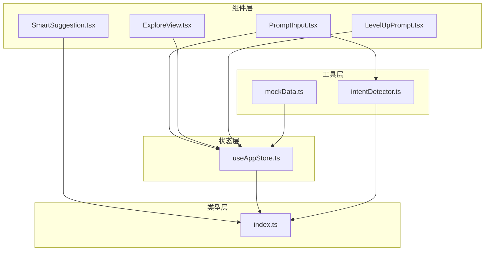
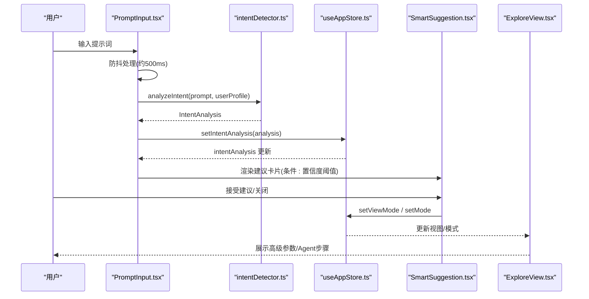
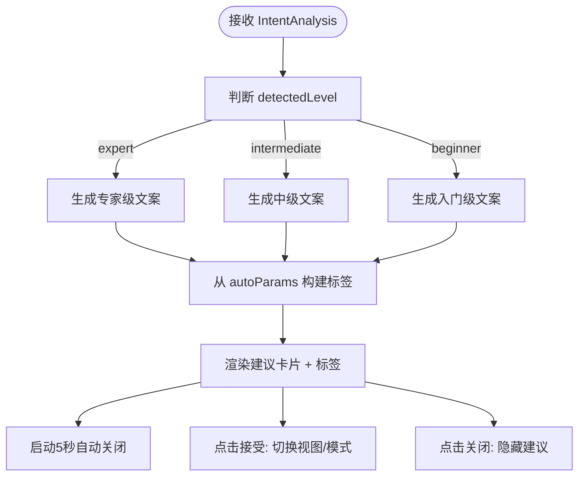
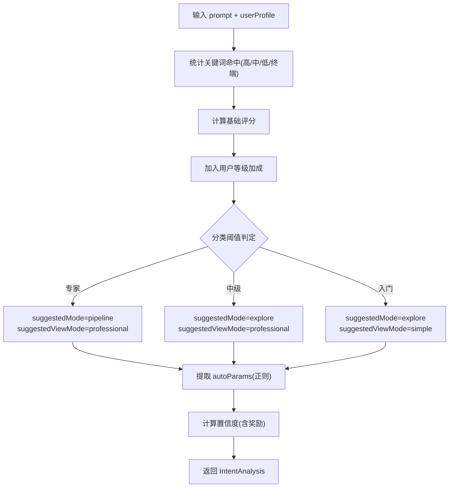
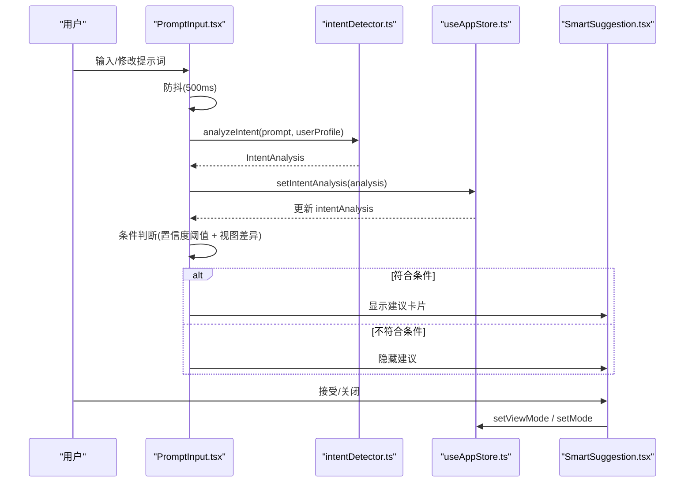
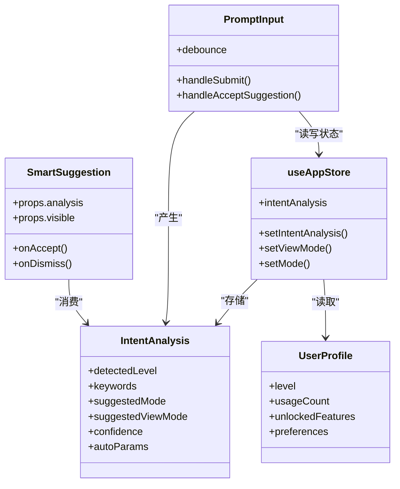

# 智能建议系统

<cite>
**本文引用的文件**
- [SmartSuggestion.tsx](file://src/components/Shared/SmartSuggestion.tsx)
- [intentDetector.ts](file://src/utils/intentDetector.ts)
- [useAppStore.ts](file://src/store/useAppStore.ts)
- [index.ts](file://src/types/index.ts)
- [PromptInput.tsx](file://src/components/Explore/PromptInput.tsx)
- [ExploreView.tsx](file://src/components/Explore/ExploreView.tsx)
- [LevelUpPrompt.tsx](file://src/components/Shared/LevelUpPrompt.tsx)
- [mockData.ts](file://src/utils/mockData.ts)
</cite>

## 目录
1. [简介](#简介)
2. [项目结构](#项目结构)
3. [核心组件](#核心组件)
4. [架构总览](#架构总览)
5. [详细组件分析](#详细组件分析)
6. [依赖关系分析](#依赖关系分析)
7. [性能考量](#性能考量)
8. [故障排查指南](#故障排查指南)
9. [结论](#结论)
10. [附录](#附录)

## 简介
本文件面向“智能建议系统”的综合文档，重点解释以下方面：
- SmartSuggestion 组件的建议生成算法与实现机制
- AI 意图检测系统的工作原理与分类逻辑
- 如何基于用户行为与上下文提供个性化建议
- 建议内容的动态生成与实时更新机制
- 智能建议的准确性评估与用户反馈收集方法
- 扩展建议算法与集成新 AI 模型的路径

该系统围绕“意图检测 + 视图/模式建议 + 参数提取 + 动态 UI 建议”构建，通过轻量规则与正则表达式实现可解释、可维护的智能建议能力，并在用户交互中持续学习与优化。

## 项目结构
系统采用分层与功能域结合的组织方式：
- 组件层：共享组件（如 SmartSuggestion）、功能视图（Explore/编辑/Pipeline）
- 工具层：意图检测工具、模拟数据、类型定义
- 状态层：Zustand 应用状态管理，持久化用户画像与建议结果
- 类型层：统一的数据结构与枚举，确保跨模块一致性

图表来源
- [PromptInput.tsx:1-160](file://src/components/Explore/PromptInput.tsx#L1-L160)
- [SmartSuggestion.tsx:1-98](file://src/components/Shared/SmartSuggestion.tsx#L1-L98)
- [ExploreView.tsx:1-263](file://src/components/Explore/ExploreView.tsx#L1-L263)
- [LevelUpPrompt.tsx:1-128](file://src/components/Shared/LevelUpPrompt.tsx#L1-L128)
- [intentDetector.ts:1-148](file://src/utils/intentDetector.ts#L1-L148)
- [useAppStore.ts:1-451](file://src/store/useAppStore.ts#L1-L451)
- [index.ts:1-206](file://src/types/index.ts#L1-L206)
- [mockData.ts:1-189](file://src/utils/mockData.ts#L1-L189)

章节来源
- [PromptInput.tsx:1-160](file://src/components/Explore/PromptInput.tsx#L1-L160)
- [SmartSuggestion.tsx:1-98](file://src/components/Shared/SmartSuggestion.tsx#L1-L98)
- [ExploreView.tsx:1-263](file://src/components/Explore/ExploreView.tsx#L1-L263)
- [LevelUpPrompt.tsx:1-128](file://src/components/Shared/LevelUpPrompt.tsx#L1-L128)
- [intentDetector.ts:1-148](file://src/utils/intentDetector.ts#L1-L148)
- [useAppStore.ts:1-451](file://src/store/useAppStore.ts#L1-L451)
- [index.ts:1-206](file://src/types/index.ts#L1-L206)
- [mockData.ts:1-189](file://src/utils/mockData.ts#L1-L189)

## 核心组件
- 智能建议组件 SmartSuggestion：负责展示检测到的用户意图级别、建议的视图/模式以及可选的自动参数标签，并提供接受或关闭的交互入口。
- 意图检测工具 intentDetector：基于关键词库与正则表达式，计算专业度评分与置信度，输出检测级别、建议模式/视图、关键词列表与可选的自动参数。
- 应用状态 useAppStore：集中管理用户画像、当前任务、意图分析结果、视图模式、聊天会话等，提供持久化与派发能力。
- 类型系统 index.ts：定义用户级别、应用模式、视图模式、意图分析结果、生成参数等核心类型，保证跨模块一致性。
- 探索视图 PromptInput：监听用户输入，触发意图分析与建议展示，支持快速建议与提交生成。
- 探索视图 ExploreView：在专业模式下展示高级参数面板与 Agent 步骤详情；在结果页展示技术细节。
- 升级提示 LevelUpPrompt：基于用户等级变化弹出升级通知，引导进入编辑/专业模式。

章节来源
- [SmartSuggestion.tsx:1-98](file://src/components/Shared/SmartSuggestion.tsx#L1-L98)
- [intentDetector.ts:1-148](file://src/utils/intentDetector.ts#L1-L148)
- [useAppStore.ts:1-451](file://src/store/useAppStore.ts#L1-L451)
- [index.ts:1-206](file://src/types/index.ts#L1-L206)
- [PromptInput.tsx:1-160](file://src/components/Explore/PromptInput.tsx#L1-L160)
- [ExploreView.tsx:1-263](file://src/components/Explore/ExploreView.tsx#L1-L263)
- [LevelUpPrompt.tsx:1-128](file://src/components/Shared/LevelUpPrompt.tsx#L1-L128)

## 架构总览
智能建议系统由“输入监听 -> 意图分析 -> 结果存储 -> UI 建议 -> 用户交互 -> 状态更新”构成闭环。其关键流程如下：

图表来源
- [PromptInput.tsx:27-50](file://src/components/Explore/PromptInput.tsx#L27-L50)
- [intentDetector.ts:77-147](file://src/utils/intentDetector.ts#L77-L147)
- [useAppStore.ts:317-319](file://src/store/useAppStore.ts#L317-L319)
- [SmartSuggestion.tsx:13-98](file://src/components/Shared/SmartSuggestion.tsx#L13-L98)
- [ExploreView.tsx:1-263](file://src/components/Explore/ExploreView.tsx#L1-L263)

## 详细组件分析

### 智能建议组件 SmartSuggestion
- 职责
  - 根据 IntentAnalysis 的 detectedLevel 生成建议文案
  - 将 autoParams 转换为 UI 标签（如输出格式、贴图分辨率、拓扑类型、面数预算）
  - 提供接受/关闭按钮，触发模式/视图切换或隐藏建议
  - 自动定时关闭（5 秒）
- 实现要点
  - 使用防抖计时器避免频繁重渲染
  - 文案与标签根据 detectedLevel 与 autoParams 动态生成
  - 通过 AnimatePresence + Framer Motion 实现平滑入场/出场动画
- 交互与状态
  - onAccept/onDismiss 回调由父组件传入，用于更新全局状态与视图

图表来源
- [SmartSuggestion.tsx:13-98](file://src/components/Shared/SmartSuggestion.tsx#L13-L98)

章节来源
- [SmartSuggestion.tsx:1-98](file://src/components/Shared/SmartSuggestion.tsx#L1-L98)

### AI 意图检测系统
- 关键词库与权重
  - 专业关键词（高/中/低权重）与终端用户典型表达模式
  - 通过 countKeywordHits 统计命中数量与匹配项
- 评分与分类
  - 评分公式：高权重×3 + 中权重×2 + 低权重×1 − 终端表达×2
  - 结合用户历史等级提供加成（专家+2，中级+1，初学者+0）
  - 分类阈值：专家（评分≥6 且高命中≥2），中级（评分≥3 且中命中≥1），否则入门
- 建议策略
  - 专家：建议 pipeline 模式 + professional 视图
  - 中级：建议 explore 模式 + professional 视图
  - 入门：建议 explore 模式 + simple 视图
- 自动参数提取
  - 基于正则表达式提取输出格式、贴图分辨率、拓扑类型、面数预算
- 置信度计算
  - 初始置信度与评分绝对值相关，再叠加“与用户当前等级一致 + 关键词命中总数≥3”的奖励
  - 最终 clamp 在 [0,1]

图表来源
- [intentDetector.ts:37-147](file://src/utils/intentDetector.ts#L37-L147)

章节来源
- [intentDetector.ts:1-148](file://src/utils/intentDetector.ts#L1-L148)
- [index.ts:118-125](file://src/types/index.ts#L118-L125)

### 动态生成与实时更新机制
- 输入监听与防抖
  - PromptInput 对用户输入进行约 500ms 防抖，避免高频分析导致性能问题
  - 当输入为空或生成进行中时，清空意图分析与建议
- 建议展示条件
  - 当置信度 ≥ 0.6 且建议视图与当前视图不同时，显示 SmartSuggestion
- 建议接受
  - 接受后立即设置视图模式与可选的应用模式，并隐藏建议
- 状态持久化
  - useAppStore 将用户画像、模板、意图分析结果等持久化到 localStorage，保证刷新后状态一致

图表来源
- [PromptInput.tsx:27-76](file://src/components/Explore/PromptInput.tsx#L27-L76)
- [useAppStore.ts:317-319](file://src/store/useAppStore.ts#L317-L319)
- [SmartSuggestion.tsx:13-98](file://src/components/Shared/SmartSuggestion.tsx#L13-L98)

章节来源
- [PromptInput.tsx:1-160](file://src/components/Explore/PromptInput.tsx#L1-L160)
- [useAppStore.ts:396-408](file://src/store/useAppStore.ts#L396-L408)

### 个性化建议与上下文融合
- 用户画像驱动
  - 用户级别、使用次数、已解锁特性、默认视图偏好等影响建议与升级提示
- 上下文感知
  - 当前视图模式、是否正在生成、首次访问状态等决定建议的可见性与文案
- 动态参数建议
  - autoParams 将用户提示中的技术参数直接映射为 UI 标签，便于快速采纳

章节来源
- [useAppStore.ts:24-34](file://src/store/useAppStore.ts#L24-L34)
- [PromptInput.tsx:13-23](file://src/components/Explore/PromptInput.tsx#L13-L23)
- [intentDetector.ts:48-75](file://src/utils/intentDetector.ts#L48-L75)

### 建议内容的动态生成与实时更新
- 文案与标签
  - 根据 detectedLevel 与 autoParams 动态生成文案与标签，减少硬编码
- 动画与交互
  - 使用 Framer Motion 实现流畅的出现/消失动画，提升用户体验
- 实时状态同步
  - 通过 Zustand 状态中心统一管理，确保 UI 与逻辑一致

章节来源
- [SmartSuggestion.tsx:27-46](file://src/components/Shared/SmartSuggestion.tsx#L27-L46)
- [ExploreView.tsx:52-146](file://src/components/Explore/ExploreView.tsx#L52-L146)

### 准确性评估与用户反馈收集
- 置信度指标
  - 系统内置置信度计算，作为建议采纳的阈值参考
- 用户行为反馈
  - 接受/关闭建议的行为可作为隐式反馈信号，辅助后续优化
- 升级提示联动
  - LevelUpPrompt 基于用户使用次数与等级变化，提供显式反馈与引导

章节来源
- [intentDetector.ts:119-134](file://src/utils/intentDetector.ts#L119-L134)
- [LevelUpPrompt.tsx:1-128](file://src/components/Shared/LevelUpPrompt.tsx#L1-L128)
- [useAppStore.ts:191-229](file://src/store/useAppStore.ts#L191-L229)

### 扩展建议算法与集成新 AI 模型
- 规则增强
  - 可在现有关键词库基础上增加领域术语与正则表达式，提升识别精度
- 外部模型集成
  - 将 analyzeIntent 替换为外部 API 调用，返回 IntentAnalysis 结构
  - 保持与现有类型一致，确保 UI 与状态层无需改动
- 数据采集与评估
  - 记录用户选择与最终结果，形成标注数据集，用于训练/微调外部模型
- A/B 测试
  - 同时保留旧版规则与新版模型，按用户分组对比置信度、采纳率与满意度

章节来源
- [intentDetector.ts:77-147](file://src/utils/intentDetector.ts#L77-L147)
- [index.ts:118-125](file://src/types/index.ts#L118-L125)

## 依赖关系分析

图表来源
- [index.ts:105-125](file://src/types/index.ts#L105-L125)
- [SmartSuggestion.tsx:6-11](file://src/components/Shared/SmartSuggestion.tsx#L6-L11)
- [PromptInput.tsx:8-23](file://src/components/Explore/PromptInput.tsx#L8-L23)
- [useAppStore.ts:93-100](file://src/store/useAppStore.ts#L93-L100)

章节来源
- [index.ts:101-125](file://src/types/index.ts#L101-L125)
- [SmartSuggestion.tsx:6-11](file://src/components/Shared/SmartSuggestion.tsx#L6-L11)
- [PromptInput.tsx:8-23](file://src/components/Explore/PromptInput.tsx#L8-L23)
- [useAppStore.ts:93-100](file://src/store/useAppStore.ts#L93-L100)

## 性能考量
- 防抖策略：PromptInput 对输入进行约 500ms 防抖，降低分析频率，避免频繁渲染
- 置信度阈值：仅当置信度 ≥ 0.6 且视图不同才显示建议，减少不必要的 UI 更新
- 动画与状态：使用 AnimatePresence 与局部状态控制建议卡片的显示/隐藏，避免全屏重绘
- 持久化：用户画像与模板持久化至 localStorage，减少初始化开销

章节来源
- [PromptInput.tsx:27-50](file://src/components/Explore/PromptInput.tsx#L27-L50)
- [SmartSuggestion.tsx:16-25](file://src/components/Shared/SmartSuggestion.tsx#L16-L25)
- [useAppStore.ts:396-408](file://src/store/useAppStore.ts#L396-L408)

## 故障排查指南
- 建议未显示
  - 检查置信度是否低于阈值（0.6）
  - 检查当前视图是否与建议视图一致
  - 检查输入是否为空或处于生成中
- 建议文案不正确
  - 检查关键词库是否覆盖用户表达
  - 检查正则表达式是否匹配用户输入的技术参数
- 建议接受无效
  - 检查 setViewMode/setMode 是否被正确调用
  - 检查 useAppStore 的状态更新是否生效
- 升级提示不出现
  - 检查用户使用次数与等级是否满足升级条件
  - 检查 LevelUpPrompt 的可见性逻辑与自动关闭定时器

章节来源
- [PromptInput.tsx:40-76](file://src/components/Explore/PromptInput.tsx#L40-L76)
- [SmartSuggestion.tsx:16-25](file://src/components/Shared/SmartSuggestion.tsx#L16-L25)
- [LevelUpPrompt.tsx:15-44](file://src/components/Shared/LevelUpPrompt.tsx#L15-L44)
- [useAppStore.ts:191-229](file://src/store/useAppStore.ts#L191-L229)

## 结论
本智能建议系统通过“规则 + 正则 + 置信度”的轻量化方案，在不引入复杂 AI 模型的前提下实现了可解释、可维护的智能建议能力。系统具备：
- 明确的意图检测与分类逻辑
- 基于用户画像与上下文的个性化建议
- 动态生成与实时更新的 UI 建议
- 可扩展的算法与模型集成路径

建议后续方向：
- 引入外部模型进行意图检测与参数抽取，结合置信度进行融合决策
- 建立用户反馈闭环，记录采纳/拒绝行为并回流训练
- 增强关键词库与正则表达式覆盖度，提升识别准确率
- 通过 A/B 测试验证新算法与模型的效果

## 附录
- 类型定义概览
  - 用户级别：beginner、intermediate、expert
  - 应用模式：explore、edit、pipeline
  - 视图模式：simple、professional
  - 意图分析结果：detectedLevel、keywords、suggestedMode、suggestedViewMode、confidence、autoParams

章节来源
- [index.ts:1-125](file://src/types/index.ts#L1-L125)