# 用户体验系统

<cite>
**本文档引用的文件**
- [FeatureGate.tsx](file://src/components/Shared/FeatureGate.tsx)
- [LevelUpPrompt.tsx](file://src/components/Shared/LevelUpPrompt.tsx)
- [SmartSuggestion.tsx](file://src/components/Shared/SmartSuggestion.tsx)
- [useProgressiveDisclosure.ts](file://src/hooks/useProgressiveDisclosure.ts)
- [useAppStore.ts](file://src/store/useAppStore.ts)
- [index.ts](file://src/types/index.ts)
- [intentDetector.ts](file://src/utils/intentDetector.ts)
- [ExploreView.tsx](file://src/components/Explore/ExploreView.tsx)
- [App.tsx](file://src/App.tsx)
- [package.json](file://package.json)
</cite>

## 目录
1. [简介](#简介)
2. [项目结构](#项目结构)
3. [核心组件](#核心组件)
4. [架构概览](#架构概览)
5. [详细组件分析](#详细组件分析)
6. [依赖关系分析](#依赖关系分析)
7. [性能考虑](#性能考虑)
8. [故障排除指南](#故障排除指南)
9. [结论](#结论)
10. [附录](#附录)

## 简介

本项目是一个基于React的3D模型生成Agent应用，专注于提供优秀的用户体验。系统通过渐进式功能解锁机制、智能功能门控、升级提示系统和智能建议算法，构建了一个完整的用户成长体系。

该用户体验系统的核心特点包括：
- **渐进式功能解锁**：基于用户使用次数的分层功能访问控制
- **智能权限管理**：动态的功能门控和模式切换控制
- **个性化升级体验**：根据用户水平提供相应的功能提示
- **智能建议系统**：基于意图分析的参数和模式建议
- **流畅的交互设计**：使用Framer Motion提供动画过渡效果

## 项目结构

项目采用模块化架构，主要分为以下几个层次：

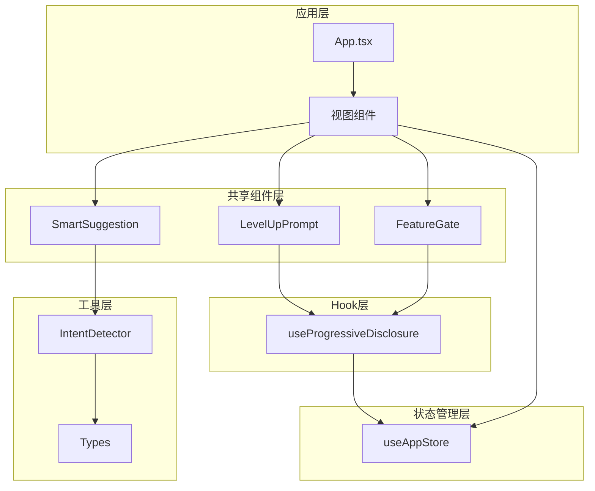

**图表来源**
- [App.tsx:10-32](file://src/App.tsx#L10-L32)
- [FeatureGate.tsx:30-86](file://src/components/Shared/FeatureGate.tsx#L30-L86)
- [LevelUpPrompt.tsx:7-127](file://src/components/Shared/LevelUpPrompt.tsx#L7-L127)
- [SmartSuggestion.tsx:13-97](file://src/components/Shared/SmartSuggestion.tsx#L13-L97)

**章节来源**
- [App.tsx:1-33](file://src/App.tsx#L1-L33)
- [package.json:1-35](file://package.json#L1-L35)

## 核心组件

### 用户级别系统

系统实现了三级用户级别体系，每个级别对应不同的功能权限和访问限制：

| 级别 | 使用次数阈值 | 可访问模式 | 解锁功能 |
|------|-------------|------------|----------|
| 初级 | 0次 | explore | 基础探索功能 |
| 中级 | 3次 | explore, edit | 材质编辑、变换、风格选择 |
| 专家 | 10次 | explore, edit, pipeline | 完整管道编辑、模板保存 |

### 功能门控机制

FeatureGate组件提供了灵活的功能访问控制，支持多种验证方式：

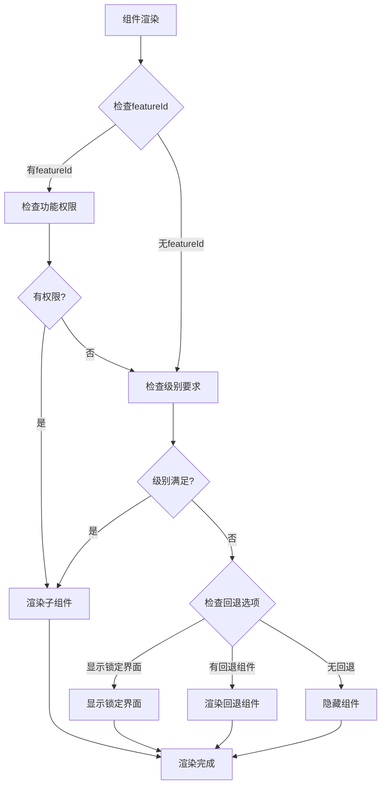

**图表来源**
- [FeatureGate.tsx:30-86](file://src/components/Shared/FeatureGate.tsx#L30-L86)

**章节来源**
- [FeatureGate.tsx:1-87](file://src/components/Shared/FeatureGate.tsx#L1-L87)
- [useProgressiveDisclosure.ts:5-42](file://src/hooks/useProgressiveDisclosure.ts#L5-L42)

## 架构概览

系统采用分层架构设计，确保各层职责清晰分离：

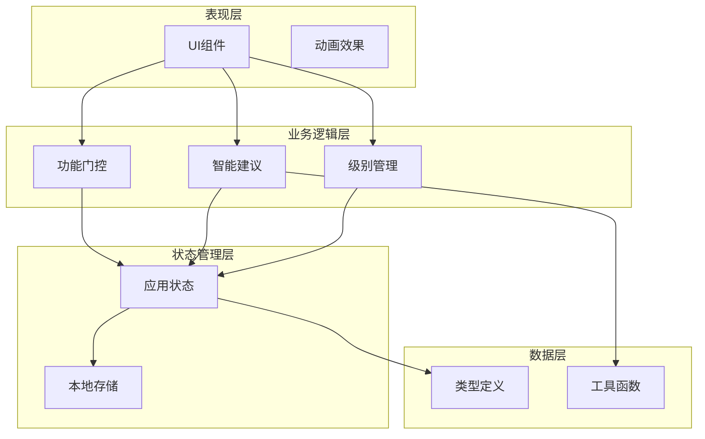

**图表来源**
- [useAppStore.ts:100-311](file://src/store/useAppStore.ts#L100-L311)
- [useProgressiveDisclosure.ts:60-135](file://src/hooks/useProgressiveDisclosure.ts#L60-L135)

## 详细组件分析

### 渐进式功能解锁机制

#### 用户级别计算逻辑

系统通过累计使用次数来判断用户级别，实现了平滑的功能解锁体验：

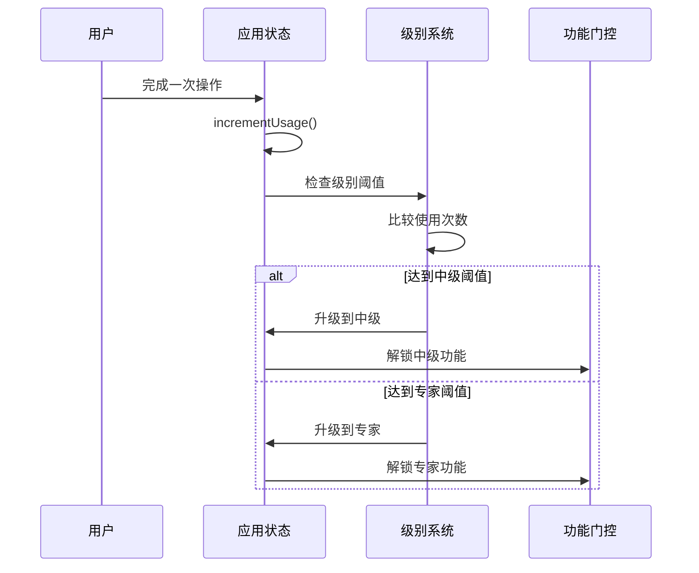

**图表来源**
- [useAppStore.ts:177-215](file://src/store/useAppStore.ts#L177-L215)
- [useProgressiveDisclosure.ts:120-122](file://src/hooks/useProgressiveDisclosure.ts#L120-L122)

#### 级别阈值配置

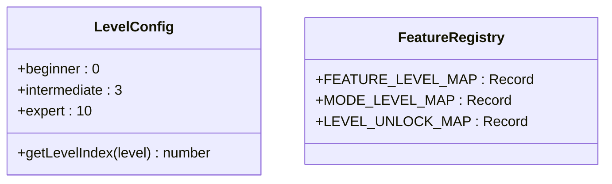

**图表来源**
- [FeatureGate.tsx:6-24](file://src/components/Shared/FeatureGate.tsx#L6-L24)
- [useProgressiveDisclosure.ts:5-42](file://src/hooks/useProgressiveDisclosure.ts#L5-L42)

**章节来源**
- [useAppStore.ts:177-215](file://src/store/useAppStore.ts#L177-L215)
- [useProgressiveDisclosure.ts:120-134](file://src/hooks/useProgressiveDisclosure.ts#L120-L134)

### FeatureGate组件功能门控机制

#### 组件架构设计

FeatureGate组件采用了组合模式，支持多种验证策略：

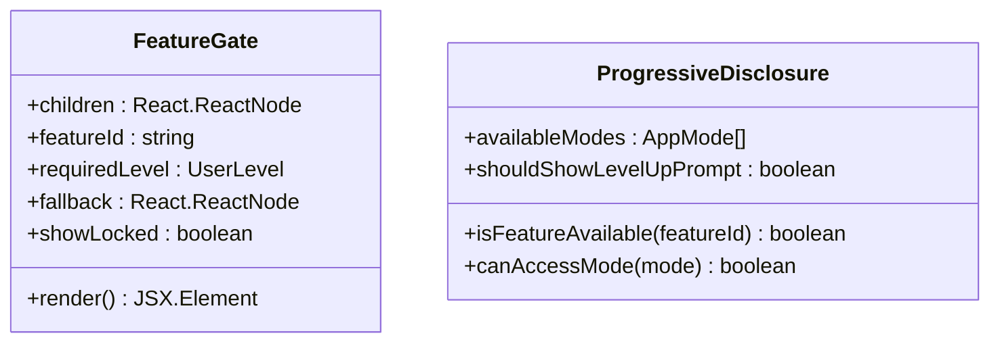

**图表来源**
- [FeatureGate.tsx:22-36](file://src/components/Shared/FeatureGate.tsx#L22-L36)
- [useProgressiveDisclosure.ts:48-58](file://src/hooks/useProgressiveDisclosure.ts#L48-L58)

#### 锁定界面设计

当用户没有权限访问特定功能时，系统会显示友好的锁定界面：

| 元素 | 描述 | 显示条件 |
|------|------|----------|
| 半透明遮罩 | 阻止用户交互 | showLocked=true |
| 锁图标 | 表示功能被锁定 | 一直显示 |
| 级别标签 | 显示需要的级别 | 一直显示 |
| 使用次数信息 | 显示还需要多少次使用 | 一直显示 |

**章节来源**
- [FeatureGate.tsx:55-78](file://src/components/Shared/FeatureGate.tsx#L55-L78)

### LevelUpPrompt升级提示系统

#### 升级提示流程

LevelUpPrompt组件提供了优雅的升级通知体验：

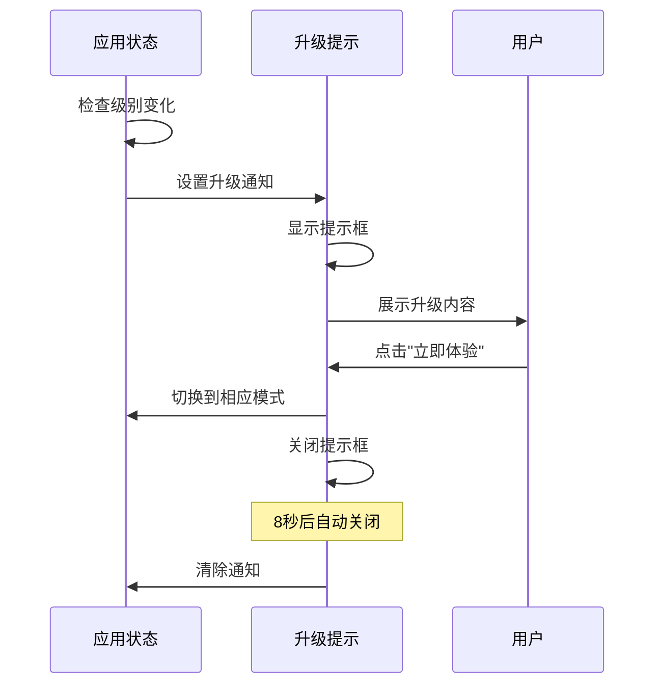

**图表来源**
- [LevelUpPrompt.tsx:15-44](file://src/components/Shared/LevelUpPrompt.tsx#L15-L44)
- [useAppStore.ts:202-214](file://src/store/useAppStore.ts#L202-L214)

#### 提示内容设计

| 级别 | 提示内容 | 功能解锁 |
|------|----------|----------|
| 中级 | 解锁编辑模式 | 材质编辑、变换、风格选择 |
| 专家 | 解锁专业模式 | 完整管道编辑、模板保存 |

**章节来源**
- [LevelUpPrompt.tsx:35-44](file://src/components/Shared/LevelUpPrompt.tsx#L35-L44)

### SmartSuggestion智能建议算法

#### 意图分析系统

智能建议算法基于自然语言处理和用户行为分析：

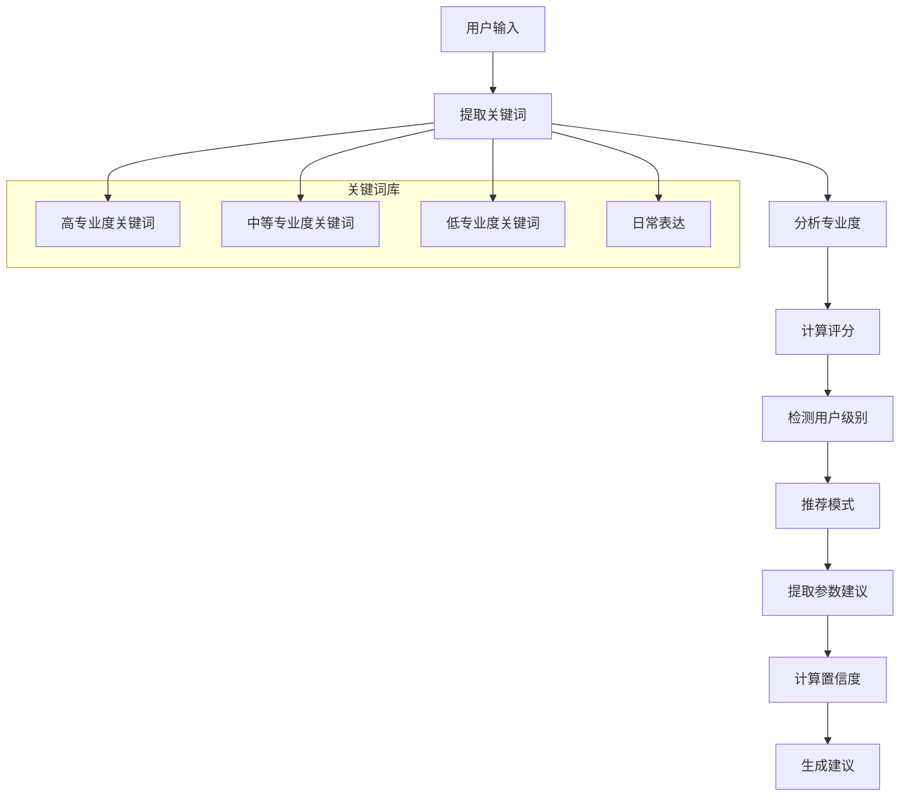

**图表来源**
- [intentDetector.ts:77-147](file://src/utils/intentDetector.ts#L77-L147)

#### 关键词权重系统

| 关键词类别 | 权重 | 示例关键词 |
|------------|------|------------|
| 高专业度 | ×3 | 拓扑、UV、PBR、LOD、法线贴图 |
| 中等专业度 | ×2 | FBX、4K、面数、材质球 |
| 低专业度 | ×1 | 渲染、光照、材质、动画 |
| 日常表达 | ×(-2) | 帮我做、可爱的、酷的 |

**章节来源**
- [intentDetector.ts:3-28](file://src/utils/intentDetector.ts#L3-L28)
- [intentDetector.ts:77-147](file://src/utils/intentDetector.ts#L77-L147)

### 用户引导流程和新用户上手体验

#### 新用户引导设计

系统为新用户提供了一套完整的引导流程：

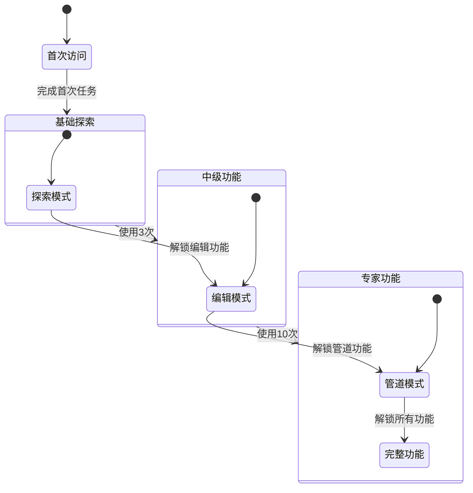

**图表来源**
- [useAppStore.ts:227-258](file://src/store/useAppStore.ts#L227-L258)
- [useProgressiveDisclosure.ts:38-42](file://src/hooks/useProgressiveDisclosure.ts#L38-L42)

#### 视图模式切换

系统支持两种视图模式，适应不同用户需求：

| 模式 | 适用场景 | 特性 |
|------|----------|------|
| 简单模式 | 新用户、快速使用 | 界面简洁、功能精简 |
| 专业模式 | 有经验用户、深度定制 | 详细参数、高级功能 |

**章节来源**
- [ExploreView.tsx:52-146](file://src/components/Explore/ExploreView.tsx#L52-L146)

## 依赖关系分析

### 核心依赖关系

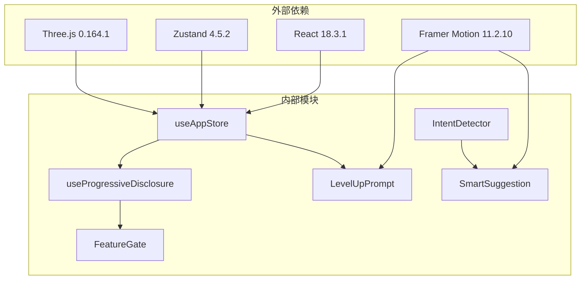

**图表来源**
- [package.json:11-22](file://package.json#L11-L22)
- [useAppStore.ts:100-311](file://src/store/useAppStore.ts#L100-L311)

### 组件间通信

系统采用单向数据流设计，确保状态管理的一致性：

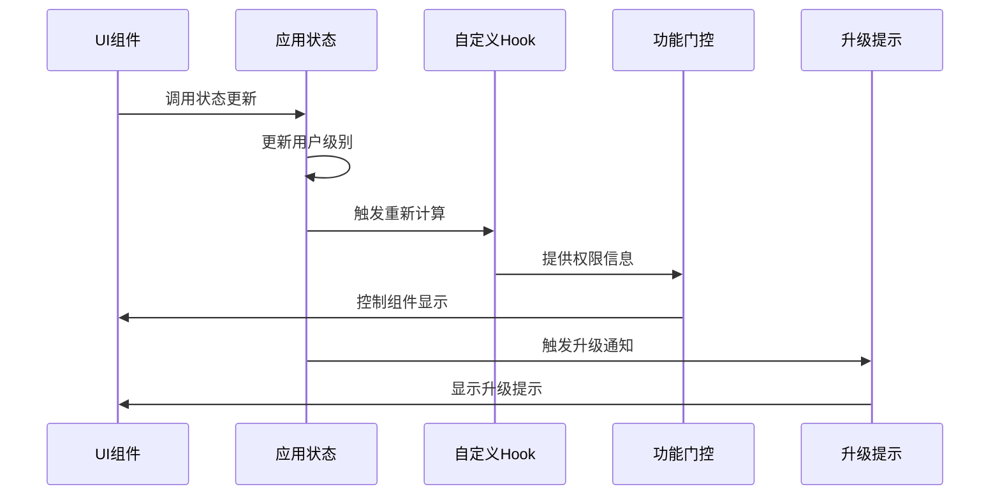

**图表来源**
- [useAppStore.ts:177-215](file://src/store/useAppStore.ts#L177-L215)
- [useProgressiveDisclosure.ts:60-135](file://src/hooks/useProgressiveDisclosure.ts#L60-L135)

**章节来源**
- [package.json:11-35](file://package.json#L11-L35)
- [useAppStore.ts:100-311](file://src/store/useAppStore.ts#L100-L311)

## 性能考虑

### 状态管理优化

系统采用Zustand作为状态管理库，具有以下优势：
- **轻量级**：相比Redux更小的包体积
- **零样板代码**：减少不必要的代码复杂度
- **类型安全**：完整的TypeScript支持
- **订阅机制**：自动响应状态变化

### 组件渲染优化

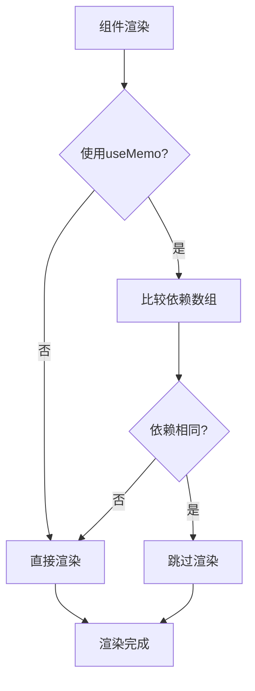

**图表来源**
- [useProgressiveDisclosure.ts:67-76](file://src/hooks/useProgressiveDisclosure.ts#L67-L76)

### 动画性能优化

系统使用Framer Motion实现流畅的动画效果：
- **硬件加速**：优先使用transform和opacity属性
- **批量更新**：避免频繁的DOM操作
- **内存管理**：及时清理定时器和事件监听器

## 故障排除指南

### 常见问题及解决方案

#### 功能无法解锁

**问题症状**：用户完成操作后功能仍不可用

**可能原因**：
1. 状态未正确更新
2. 权限检查逻辑异常
3. 本地存储数据损坏

**解决步骤**：
1. 检查用户使用次数是否正确累加
2. 验证权限映射表配置
3. 清除浏览器本地存储数据

#### 升级提示不显示

**问题症状**：用户达到级别阈值但未收到升级提示

**可能原因**：
1. 级别变更检测逻辑异常
2. 通知状态管理问题
3. 动画组件渲染问题

**解决步骤**：
1. 检查级别提升触发条件
2. 验证通知状态设置逻辑
3. 确认动画组件生命周期

#### 智能建议不准确

**问题症状**：系统给出的建议与用户需求不符

**可能原因**：
1. 关键词匹配算法问题
2. 专业度评分权重不当
3. 用户历史级别影响

**解决步骤**：
1. 调整关键词权重系数
2. 优化评分计算逻辑
3. 测试不同用户级别的建议准确性

**章节来源**
- [useAppStore.ts:314-325](file://src/store/useAppStore.ts#L314-L325)
- [useProgressiveDisclosure.ts:80-94](file://src/hooks/useProgressiveDisclosure.ts#L80-L94)

## 结论

本用户体验系统通过精心设计的渐进式功能解锁机制、智能权限控制和个性化建议算法，为用户提供了流畅而富有成就感的使用体验。系统的主要优势包括：

1. **清晰的用户成长路径**：从基础功能到高级功能的平滑过渡
2. **智能化的交互设计**：基于用户意图的自动建议和模式切换
3. **优雅的视觉反馈**：通过动画和提示增强用户体验
4. **可扩展的架构设计**：模块化的组件结构便于功能扩展

未来可以在以下方面进一步优化：
- 增加A/B测试框架以量化用户体验改进
- 扩展智能建议算法的准确性
- 添加更多个性化定制选项
- 实现离线功能支持

## 附录

### 类型定义参考

系统使用TypeScript确保类型安全，主要类型包括：

- **UserLevel**：用户级别枚举
- **AppMode**：应用模式枚举  
- **GenerationStatus**：生成状态枚举
- **IntentAnalysis**：意图分析结果接口
- **UserProfile**：用户档案接口

### 开发最佳实践

1. **组件设计原则**：
   - 单一职责原则
   - 可复用性优先
   - 明确的props接口

2. **状态管理规范**：
   - 集中式状态管理
   - 不可变数据更新
   - 合理的状态拆分

3. **性能优化要点**：
   - 使用useMemo和useCallback
   - 避免不必要的重渲染
   - 合理的动画使用