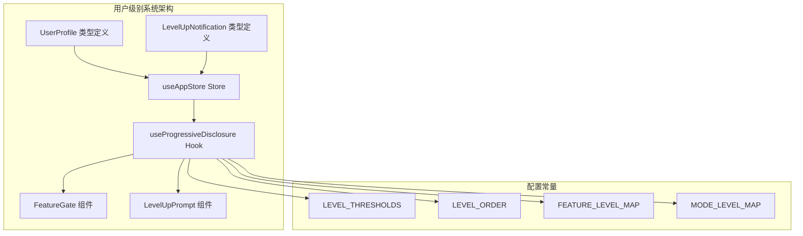
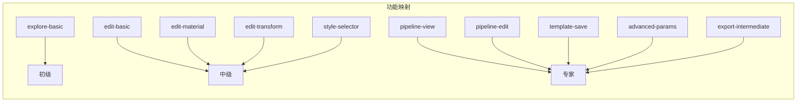
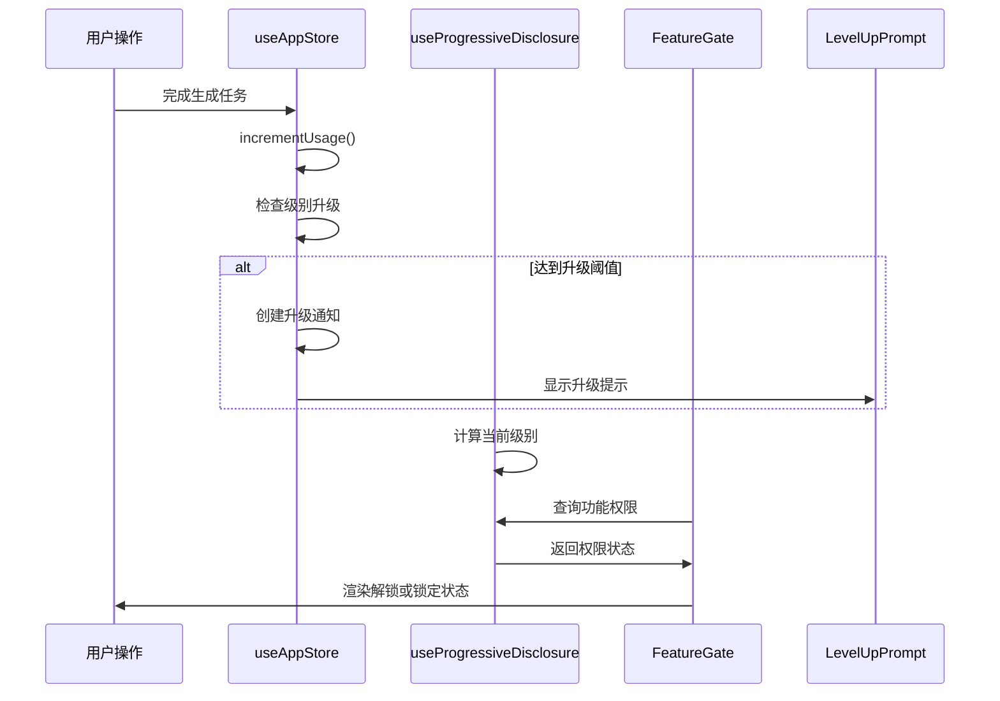
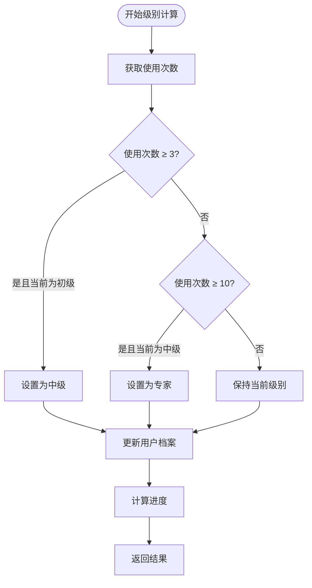
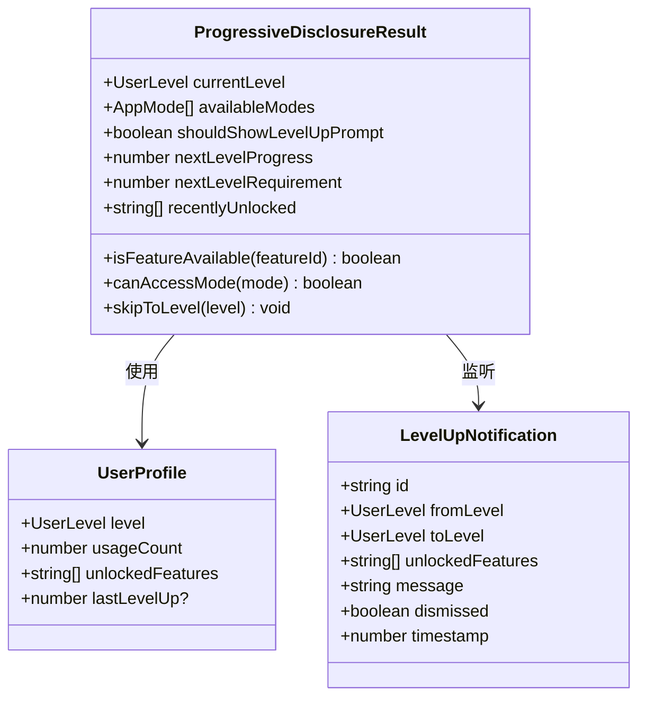
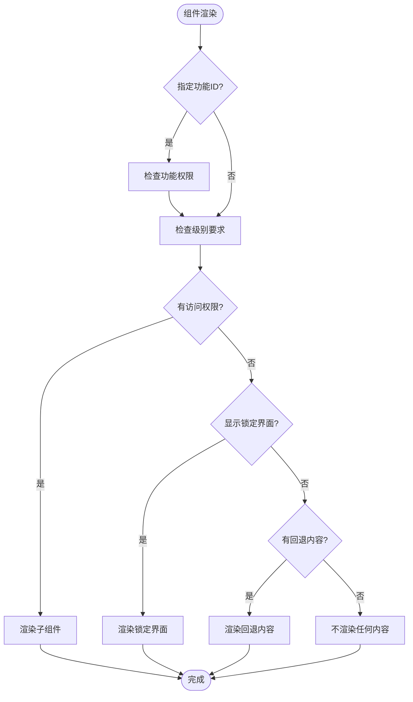
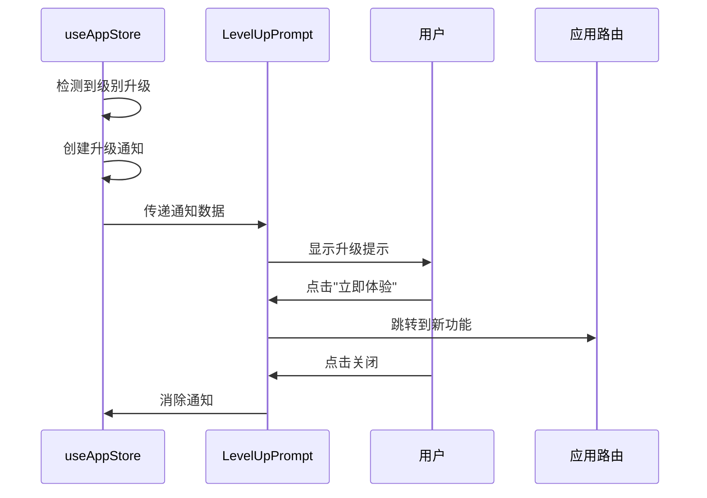
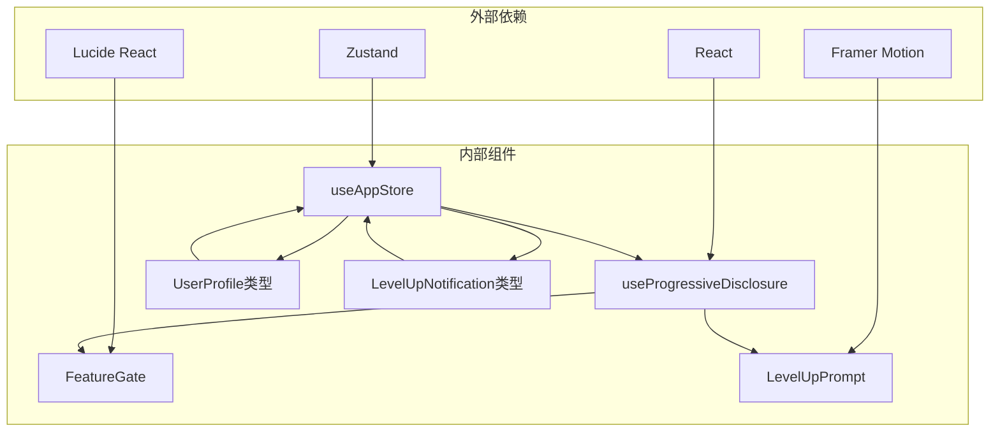

# 用户级别系统

<cite>
**本文档引用的文件**
- [useProgressiveDisclosure.ts](file://src/hooks/useProgressiveDisclosure.ts)
- [FeatureGate.tsx](file://src/components/Shared/FeatureGate.tsx)
- [LevelUpPrompt.tsx](file://src/components/Shared/LevelUpPrompt.tsx)
- [useAppStore.ts](file://src/store/useAppStore.ts)
- [index.ts](file://src/types/index.ts)
</cite>

## 目录
1. [简介](#简介)
2. [项目结构](#项目结构)
3. [核心组件](#核心组件)
4. [架构概览](#架构概览)
5. [详细组件分析](#详细组件分析)
6. [依赖关系分析](#依赖关系分析)
7. [性能考虑](#性能考虑)
8. [故障排除指南](#故障排除指南)
9. [结论](#结论)

## 简介

用户级别系统是3D模型代理应用中的渐进式功能解锁机制，旨在通过逐步开放功能来提升用户体验并保持学习曲线的合理性。该系统基于使用次数统计，为用户提供从初学者到专家用户的渐进式体验。

系统的核心设计理念包括：
- **渐进式学习**：通过使用次数阈值逐步解锁功能
- **用户体验优化**：提供明确的功能解锁进度反馈
- **功能权限控制**：确保用户只能访问其级别的功能
- **即时反馈机制**：在功能解锁时提供视觉和交互反馈

## 项目结构

用户级别系统主要分布在以下文件中：

**图表来源**
- [useProgressiveDisclosure.ts:1-135](file://src/hooks/useProgressiveDisclosure.ts#L1-L135)
- [FeatureGate.tsx:1-87](file://src/components/Shared/FeatureGate.tsx#L1-L87)
- [LevelUpPrompt.tsx:1-128](file://src/components/Shared/LevelUpPrompt.tsx#L1-L128)

**章节来源**
- [useProgressiveDisclosure.ts:1-135](file://src/hooks/useProgressiveDisclosure.ts#L1-L135)
- [FeatureGate.tsx:1-87](file://src/components/Shared/FeatureGate.tsx#L1-L87)
- [LevelUpPrompt.tsx:1-128](file://src/components/Shared/LevelUpPrompt.tsx#L1-L128)

## 核心组件

### 用户级别阈值配置

系统采用固定的使用次数阈值来定义不同级别的解锁条件：

| 级别 | 阈值 | 解锁功能 |
|------|------|----------|
| 初级 (beginner) | 0次 | 探索基础功能 |
| 中级 (intermediate) | 3次 | 编辑功能、样式选择器 |
| 专家 (expert) | 10次 | 流水线编辑、模板保存 |

### 功能映射表

系统维护了完整的功能与级别映射关系：

**图表来源**
- [useProgressiveDisclosure.ts:6-17](file://src/hooks/useProgressiveDisclosure.ts#L6-L17)

**章节来源**
- [useProgressiveDisclosure.ts:6-17](file://src/hooks/useProgressiveDisclosure.ts#L6-L17)
- [useProgressiveDisclosure.ts:20-24](file://src/hooks/useProgressiveDisclosure.ts#L20-L24)

## 架构概览

用户级别系统采用React Hooks + Zustand状态管理的架构模式：

**图表来源**
- [useAppStore.ts:177-215](file://src/store/useAppStore.ts#L177-L215)
- [useProgressiveDisclosure.ts:60-135](file://src/hooks/useProgressiveDisclosure.ts#L60-L135)
- [FeatureGate.tsx:30-86](file://src/components/Shared/FeatureGate.tsx#L30-L86)

## 详细组件分析

### useProgressiveDisclosure Hook

这是用户级别系统的核心逻辑实现，负责：

#### 主要功能
- **级别计算**：根据使用次数计算当前用户级别
- **功能权限验证**：检查特定功能是否对当前用户开放
- **模式访问控制**：验证用户是否可以访问特定应用模式
- **进度跟踪**：计算距离下一个级别的进度百分比

#### 关键算法

**图表来源**
- [useAppStore.ts:177-215](file://src/store/useAppStore.ts#L177-L215)
- [useProgressiveDisclosure.ts:96-113](file://src/hooks/useProgressiveDisclosure.ts#L96-L113)

#### 数据结构

**图表来源**
- [useProgressiveDisclosure.ts:48-58](file://src/hooks/useProgressiveDisclosure.ts#L48-L58)
- [index.ts:105-116](file://src/types/index.ts#L105-L116)
- [index.ts:151-159](file://src/types/index.ts#L151-L159)

**章节来源**
- [useProgressiveDisclosure.ts:60-135](file://src/hooks/useProgressiveDisclosure.ts#L60-L135)
- [useProgressiveDisclosure.ts:44-46](file://src/hooks/useProgressiveDisclosure.ts#L44-L46)

### FeatureGate 组件

功能门控组件负责在UI层面实现功能权限控制：

#### 核心特性
- **条件渲染**：根据用户级别动态显示或隐藏功能
- **锁定界面**：当功能被锁定时显示半透明覆盖层
- **升级提示**：显示需要达到的级别要求
- **可选回退**：提供自定义的回退内容

#### 渲染流程

**图表来源**
- [FeatureGate.tsx:30-86](file://src/components/Shared/FeatureGate.tsx#L30-L86)

**章节来源**
- [FeatureGate.tsx:30-86](file://src/components/Shared/FeatureGate.tsx#L30-L86)

### LevelUpPrompt 组件

升级提示组件提供用户友好的升级反馈：

#### 功能特性
- **自动显示**：检测到级别升级时自动弹出
- **智能关闭**：8秒后自动消失，支持手动关闭
- **一键跳转**：升级后直接跳转到新功能
- **视觉反馈**：使用动画效果增强用户体验

#### 升级流程

**图表来源**
- [LevelUpPrompt.tsx:7-44](file://src/components/Shared/LevelUpPrompt.tsx#L7-L44)
- [useAppStore.ts:202-214](file://src/store/useAppStore.ts#L202-L214)

**章节来源**
- [LevelUpPrompt.tsx:7-128](file://src/components/Shared/LevelUpPrompt.tsx#L7-L128)

### useAppStore 状态管理

Zustand状态管理器负责整个用户级别系统的状态持久化：

#### 核心方法

| 方法名 | 功能描述 | 触发条件 |
|--------|----------|----------|
| incrementUsage | 增加使用次数并检查升级 | 任务完成后调用 |
| checkLevelUp | 检查当前使用次数是否达到升级阈值 | 系统启动时调用 |
| setUserLevel | 手动设置用户级别 | 开发者工具或调试时使用 |
| unlockFeature | 解锁特定功能 | 特殊情况或手动解锁 |

#### 状态持久化

系统使用localStorage自动保存用户状态，确保刷新页面后级别信息不会丢失。

**章节来源**
- [useAppStore.ts:177-215](file://src/store/useAppStore.ts#L177-L215)
- [useAppStore.ts:314-325](file://src/store/useAppStore.ts#L314-L325)

## 依赖关系分析

用户级别系统各组件之间的依赖关系如下：

**图表来源**
- [useProgressiveDisclosure.ts:1-3](file://src/hooks/useProgressiveDisclosure.ts#L1-L3)
- [FeatureGate.tsx:1-4](file://src/components/Shared/FeatureGate.tsx#L1-L4)
- [LevelUpPrompt.tsx:1-5](file://src/components/Shared/LevelUpPrompt.tsx#L1-L5)

### 组件耦合度分析

- **低耦合设计**：各组件职责单一，通过Hook和Store进行通信
- **单向数据流**：状态从Store流向各个组件，避免循环依赖
- **类型安全**：完整的TypeScript类型定义确保编译时安全性

**章节来源**
- [index.ts:101-116](file://src/types/index.ts#L101-L116)

## 性能考虑

### 内存优化
- **useMemo缓存**：对计算结果进行缓存，避免重复计算
- **状态分片**：将用户级别状态与其他应用状态分离
- **事件监听**：合理管理组件生命周期内的事件绑定

### 运行时性能
- **级别计算复杂度**：O(1)时间复杂度，基于固定阈值判断
- **功能权限检查**：O(n)时间复杂度，n为已解锁功能数量
- **UI渲染优化**：使用React.memo减少不必要的重新渲染

### 存储性能
- **本地存储**：使用localStorage进行状态持久化
- **序列化开销**：用户档案大小较小，JSON序列化开销可忽略
- **同步策略**：使用订阅模式自动同步状态变化

## 故障排除指南

### 常见问题及解决方案

#### 问题1：功能无法解锁
**症状**：用户达到使用次数但功能仍被锁定
**排查步骤**：
1. 检查用户档案中的unlockedFeatures数组
2. 验证FEATURE_LEVEL_MAP映射关系
3. 确认级别阈值配置正确

#### 问题2：升级提示不显示
**症状**：用户成功升级但没有看到升级提示
**排查步骤**：
1. 检查levelUpNotification状态
2. 验证shouldShowLevelUpPrompt计算逻辑
3. 确认LevelUpPrompt组件正确接收状态

#### 问题3：级别计算错误
**症状**：用户使用次数正确但级别显示异常
**排查步骤**：
1. 检查LEVEL_THRESHOLDS配置
2. 验证LEVEL_ORDER排序
3. 确认getLevelIndex函数实现

**章节来源**
- [useProgressiveDisclosure.ts:80-94](file://src/hooks/useProgressiveDisclosure.ts#L80-L94)
- [useAppStore.ts:227-258](file://src/store/useAppStore.ts#L227-L258)

## 结论

用户级别系统通过精心设计的渐进式功能解锁机制，为3D模型代理应用提供了优秀的用户体验。系统的主要优势包括：

### 设计亮点
- **清晰的学习路径**：从基础功能到高级功能的自然过渡
- **即时反馈机制**：让用户清楚了解自己的进步和可获得的功能
- **灵活的扩展性**：易于添加新的功能和级别
- **良好的性能表现**：高效的计算和渲染机制

### 用户体验价值
- **降低学习门槛**：避免新用户面对过多复杂功能而感到困惑
- **增强成就感**：通过可视化的升级进度激励用户继续探索
- **个性化体验**：根据用户能力提供合适的功能组合
- **平滑过渡**：确保用户在不同功能间的切换顺畅自然

该系统为类似复杂工具的应用提供了一个可复用的渐进式功能解锁框架，值得在其他产品中推广使用。