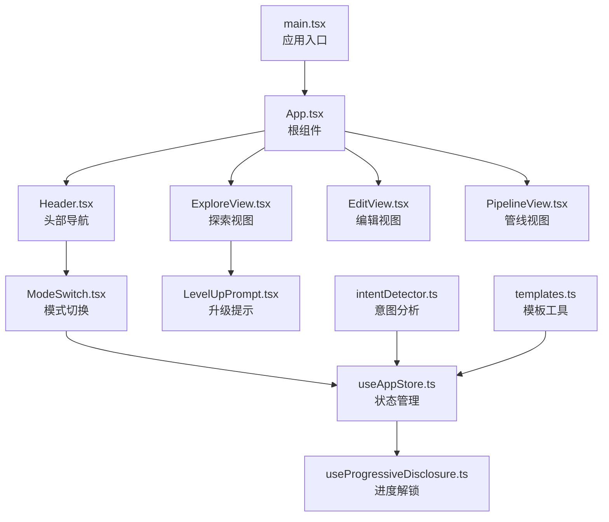
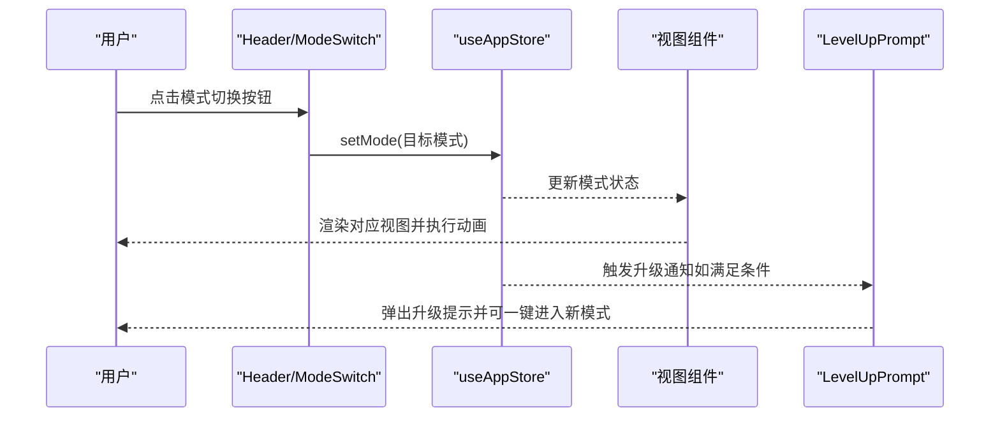
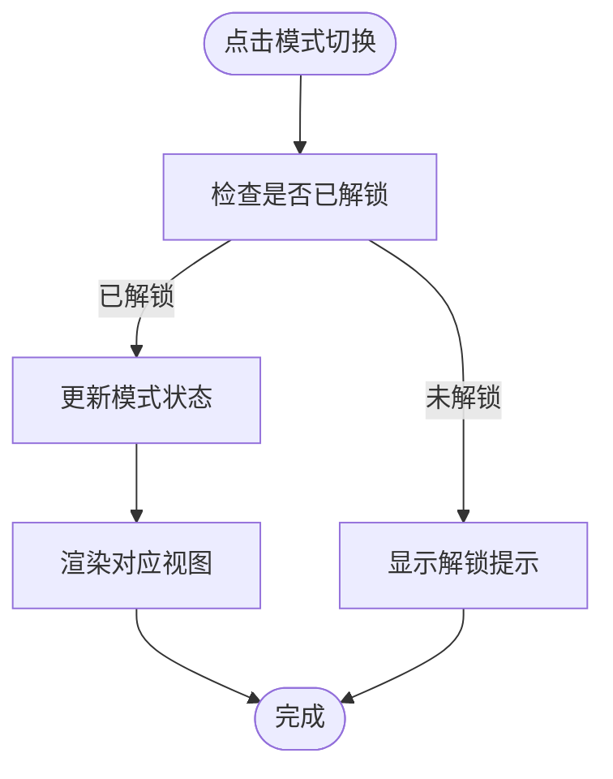
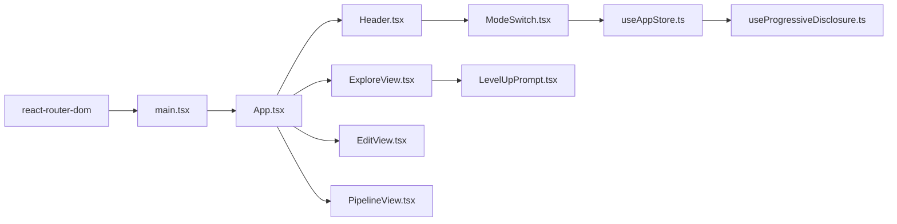

# 路由和导航

<cite>
**本文引用的文件**
- [main.tsx](file://src/main.tsx)
- [App.tsx](file://src/App.tsx)
- [Header.tsx](file://src/components/Layout/Header.tsx)
- [ModeSwitch.tsx](file://src/components/Layout/ModeSwitch.tsx)
- [useAppStore.ts](file://src/store/useAppStore.ts)
- [useProgressiveDisclosure.ts](file://src/hooks/useProgressiveDisclosure.ts)
- [ExploreView.tsx](file://src/components/Explore/ExploreView.tsx)
- [EditView.tsx](file://src/components/Edit/EditView.tsx)
- [PipelineView.tsx](file://src/components/Pipeline/PipelineView.tsx)
- [LevelUpPrompt.tsx](file://src/components/Shared/LevelUpPrompt.tsx)
- [intentDetector.ts](file://src/utils/intentDetector.ts)
- [templates.ts](file://src/utils/templates.ts)
- [package.json](file://package.json)
- [types/index.ts](file://src/types/index.ts)
</cite>

## 目录
1. [简介](#简介)
2. [项目结构](#项目结构)
3. [核心组件](#核心组件)
4. [架构总览](#架构总览)
5. [详细组件分析](#详细组件分析)
6. [依赖关系分析](#依赖关系分析)
7. [性能考虑](#性能考虑)
8. [故障排查指南](#故障排查指南)
9. [结论](#结论)
10. [附录](#附录)

## 简介
本文件系统性梳理本项目的路由与导航体系，重点覆盖以下方面：
- React Router 的配置与页面路由管理现状
- 模式切换机制（探索/编辑/管线）与用户界面导航
- Header 组件设计与交互逻辑
- 导航状态管理与“进度解锁”机制
- 面包屑导航与页面标题管理的实现方式
- 路由参数传递与查询字符串处理方法
- 页面缓存与性能优化策略
- SEO 优化与元数据管理实践

需要特别说明的是：当前代码库采用“应用内模式切换”的设计，而非传统基于浏览器路由的页面跳转。因此，本文将围绕该模式切换架构展开说明，并指出与标准 React Router 路由的差异与替代方案。

## 项目结构
项目采用按功能域分层的组织方式，路由与导航相关的关键文件如下：
- 应用入口与路由容器：src/main.tsx
- 应用根组件与模式渲染：src/App.tsx
- 导航头部与模式切换：src/components/Layout/Header.tsx、src/components/Layout/ModeSwitch.tsx
- 状态管理与用户进度：src/store/useAppStore.ts、src/hooks/useProgressiveDisclosure.ts
- 视图组件：ExploreView.tsx、EditView.tsx、PipelineView.tsx
- 进度提示与自动导航：src/components/Shared/LevelUpPrompt.tsx
- 工具函数：src/utils/intentDetector.ts、src/utils/templates.ts
- 类型定义：src/types/index.ts

图表来源
- [main.tsx:1-14](file://src/main.tsx#L1-L14)
- [App.tsx:10-32](file://src/App.tsx#L10-L32)
- [Header.tsx:8-77](file://src/components/Layout/Header.tsx#L8-L77)
- [ModeSwitch.tsx:18-81](file://src/components/Layout/ModeSwitch.tsx#L18-L81)
- [ExploreView.tsx:11-263](file://src/components/Explore/ExploreView.tsx#L11-L263)
- [EditView.tsx:9-159](file://src/components/Edit/EditView.tsx#L9-L159)
- [PipelineView.tsx:9-168](file://src/components/Pipeline/PipelineView.tsx#L9-L168)
- [useAppStore.ts:100-311](file://src/store/useAppStore.ts#L100-L311)
- [useProgressiveDisclosure.ts:60-135](file://src/hooks/useProgressiveDisclosure.ts#L60-L135)
- [LevelUpPrompt.tsx:7-128](file://src/components/Shared/LevelUpPrompt.tsx#L7-L128)

章节来源
- [main.tsx:1-14](file://src/main.tsx#L1-L14)
- [App.tsx:10-32](file://src/App.tsx#L10-L32)

## 核心组件
- 应用入口与路由容器
  - 在应用入口通过浏览器路由容器包裹应用，但未在应用内部使用路由进行页面跳转，而是通过状态驱动的模式切换实现页面内容切换。
- 根组件与模式渲染
  - 根组件根据当前模式渲染不同的视图组件，配合动画过渡提升用户体验。
- 头部导航与模式切换
  - 头部组件包含品牌标识、右侧操作区以及模式切换控件；模式切换控件负责根据用户进度解锁状态控制可访问模式。
- 状态管理与进度解锁
  - 使用状态存储当前模式、用户等级、使用次数等信息，并通过进度钩子计算可用模式集合与解锁条件。
- 视图组件
  - 探索视图、编辑视图、管线视图分别承载不同层级的功能与交互。
- 升级提示与自动导航
  - 当用户达到特定使用次数时弹出升级提示，支持一键进入新解锁的模式。

章节来源
- [main.tsx:3-12](file://src/main.tsx#L3-L12)
- [App.tsx:23-27](file://src/App.tsx#L23-L27)
- [Header.tsx:31-31](file://src/components/Layout/Header.tsx#L31-L31)
- [ModeSwitch.tsx:18-81](file://src/components/Layout/ModeSwitch.tsx#L18-L81)
- [useAppStore.ts:100-311](file://src/store/useAppStore.ts#L100-L311)
- [useProgressiveDisclosure.ts:60-135](file://src/hooks/useProgressiveDisclosure.ts#L60-L135)
- [LevelUpPrompt.tsx:7-128](file://src/components/Shared/LevelUpPrompt.tsx#L7-L128)

## 架构总览
本项目采用“应用内模式切换”架构，不依赖浏览器路由进行页面跳转。其核心要点如下：
- 入口使用浏览器路由容器，但应用内部通过状态驱动模式切换。
- 用户进度与功能解锁通过状态与进度钩子共同决定。
- 不同模式对应不同的视图组件，配合动画过渡实现平滑切换。
- 升级提示组件在满足条件时自动弹出并支持一键导航至新模式。

图表来源
- [ModeSwitch.tsx:32-38](file://src/components/Layout/ModeSwitch.tsx#L32-L38)
- [useAppStore.ts:100-102](file://src/store/useAppStore.ts#L100-L102)
- [App.tsx:23-27](file://src/App.tsx#L23-L27)
- [LevelUpPrompt.tsx:35-44](file://src/components/Shared/LevelUpPrompt.tsx#L35-L44)

## 详细组件分析

### 模式切换机制与导航状态管理
- 模式类型与状态
  - 模式类型包括探索、编辑、管线三种，状态通过全局状态统一管理。
- 解锁条件与进度
  - 用户使用次数达到阈值后解锁更高级模式；进度钩子计算当前可用模式集合与升级进度。
- 导航行为
  - 点击模式切换按钮时，若未解锁则显示提示；已解锁则更新模式状态并触发视图切换。

图表来源
- [ModeSwitch.tsx:32-38](file://src/components/Layout/ModeSwitch.tsx#L32-L38)
- [useAppStore.ts:100-102](file://src/store/useAppStore.ts#L100-L102)
- [useProgressiveDisclosure.ts:71-76](file://src/hooks/useProgressiveDisclosure.ts#L71-L76)

章节来源
- [ModeSwitch.tsx:18-81](file://src/components/Layout/ModeSwitch.tsx#L18-L81)
- [useAppStore.ts:100-311](file://src/store/useAppStore.ts#L100-L311)
- [useProgressiveDisclosure.ts:60-135](file://src/hooks/useProgressiveDisclosure.ts#L60-L135)

### Header 组件设计与功能实现
- 品牌标识与徽章
  - 包含品牌图标与在线状态徽章，增强品牌识别。
- 模式切换控件
  - 根据用户进度动态显示可访问模式；激活态与锁定态样式区分明显。
- 视图模式切换
  - 在中级及以上级别显示“简洁/专业”视图模式切换按钮，支持布局与功能密度的自适应。
- 右侧操作区
  - 积分展示、消息提醒与用户头像，保持界面整洁与信息层级清晰。

章节来源
- [Header.tsx:8-77](file://src/components/Layout/Header.tsx#L8-L77)

### 视图组件与页面标题管理
- 探索视图
  - 输入阶段、生成阶段与结果阶段的三段式流程；专业模式下展示详细 Agent 步骤与技术指标。
- 编辑视图
  - 简洁模式与专业模式双态；专业模式下提供材质、变换、光照等完整面板。
- 管线索引
  - 简洁模式以线性步骤列表呈现；专业模式提供节点图与参数面板。
- 页面标题管理
  - 当前实现未见显式的页面标题设置逻辑；可在各视图组件挂载时通过副作用设置 document.title 或使用第三方库进行统一管理。

章节来源
- [ExploreView.tsx:11-263](file://src/components/Explore/ExploreView.tsx#L11-L263)
- [EditView.tsx:9-159](file://src/components/Edit/EditView.tsx#L9-L159)
- [PipelineView.tsx:9-168](file://src/components/Pipeline/PipelineView.tsx#L9-L168)

### 面包屑导航与页面标题管理
- 面包屑导航
  - 当前未实现显式面包屑导航；可在根组件或视图组件中引入面包屑组件，并结合当前模式与任务上下文生成路径。
- 页面标题管理
  - 可在各视图组件挂载时设置 document.title，或通过路由元信息与通用标题组件统一管理。

章节来源
- [App.tsx:23-27](file://src/App.tsx#L23-L27)

### 路由参数传递与查询字符串处理
- 参数传递
  - 当前未使用浏览器路由参数；如需参数传递，可在现有模式切换基础上扩展为“模式 + 参数”的组合状态，或引入路由参数映射。
- 查询字符串处理
  - 可通过 URLSearchParams 读取查询参数并同步到状态，再驱动视图渲染。

章节来源
- [main.tsx:3-12](file://src/main.tsx#L3-L12)
- [App.tsx:23-27](file://src/App.tsx#L23-L27)

### 页面缓存与性能优化策略
- 动画过渡
  - 使用动画库实现视图切换的平滑过渡，减少白屏与闪烁。
- 状态持久化
  - 用户偏好与模板数据通过本地存储持久化，减少重复加载。
- 条件渲染
  - 仅在必要时渲染专业模式下的复杂面板，降低首屏渲染压力。
- 性能建议
  - 对于大型视图组件可考虑懒加载；对频繁更新的状态进行细粒度拆分；对长列表使用虚拟化。

章节来源
- [App.tsx:23-27](file://src/App.tsx#L23-L27)
- [useAppStore.ts:313-325](file://src/store/useAppStore.ts#L313-L325)

### SEO 优化与元数据管理
- 当前实现
  - 未见显式的 SEO 元数据管理；可在根组件或视图组件中引入通用元数据组件，按模式与任务上下文动态设置标题、描述与关键词。
- 实施建议
  - 使用 head 标签库或自定义 Hook 管理 meta 标签；为不同模式与任务生成差异化标题与描述。

章节来源
- [App.tsx:23-27](file://src/App.tsx#L23-L27)

## 依赖关系分析
- 外部依赖
  - React Router、Framer Motion、Lucide React、Zustand、Three.js 生态等。
- 内部依赖
  - Header 依赖 ModeSwitch 与状态；ModeSwitch 依赖状态与进度钩子；视图组件依赖状态与动画库；升级提示依赖状态与进度钩子。

图表来源
- [package.json:11-21](file://package.json#L11-L21)
- [main.tsx:3-12](file://src/main.tsx#L3-L12)
- [App.tsx:10-32](file://src/App.tsx#L10-L32)
- [Header.tsx:3-4](file://src/components/Layout/Header.tsx#L3-L4)
- [ModeSwitch.tsx:4-5](file://src/components/Layout/ModeSwitch.tsx#L4-L5)
- [useAppStore.ts:100-311](file://src/store/useAppStore.ts#L100-L311)
- [useProgressiveDisclosure.ts:60-135](file://src/hooks/useProgressiveDisclosure.ts#L60-L135)
- [ExploreView.tsx:11-263](file://src/components/Explore/ExploreView.tsx#L11-L263)
- [EditView.tsx:9-159](file://src/components/Edit/EditView.tsx#L9-L159)
- [PipelineView.tsx:9-168](file://src/components/Pipeline/PipelineView.tsx#L9-L168)
- [LevelUpPrompt.tsx:7-128](file://src/components/Shared/LevelUpPrompt.tsx#L7-L128)

章节来源
- [package.json:11-21](file://package.json#L11-L21)

## 性能考虑
- 动画与过渡
  - 使用轻量动画库实现视图切换，避免重型动画导致卡顿。
- 状态更新
  - 将大对象拆分为多个小状态，减少不必要的重渲染。
- 视图懒加载
  - 对专业模式下的复杂面板与编辑器组件进行懒加载，按需加载。
- 本地存储
  - 将用户偏好与模板持久化，减少网络请求与初始化时间。

## 故障排查指南
- 模式切换无效
  - 检查用户进度是否满足解锁条件；确认状态更新是否正确触发视图重渲染。
- 升级提示不出现
  - 检查使用次数与等级阈值；确认升级通知状态是否被手动关闭。
- 专业模式面板空白
  - 检查当前任务是否存在；确保 Agent 步骤数据已正确填充。

章节来源
- [ModeSwitch.tsx:32-38](file://src/components/Layout/ModeSwitch.tsx#L32-L38)
- [useAppStore.ts:177-215](file://src/store/useAppStore.ts#L177-L215)
- [PipelineView.tsx:27-34](file://src/components/Pipeline/PipelineView.tsx#L27-L34)

## 结论
本项目采用“应用内模式切换”架构，通过状态与进度钩子实现灵活的导航与功能解锁。该设计简化了路由复杂度，提升了用户体验的一致性。若未来需要支持深度链接、书签或多标签页场景，可考虑引入轻量路由方案或在现有模式切换基础上扩展参数化导航。

## 附录
- 类型定义概览
  - 模式类型、用户等级、视图模式、任务与参数结构等均在类型文件中集中定义，便于维护与扩展。

章节来源
- [types/index.ts:1-160](file://src/types/index.ts#L1-L160)