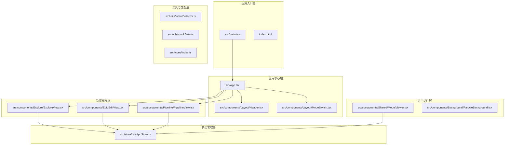
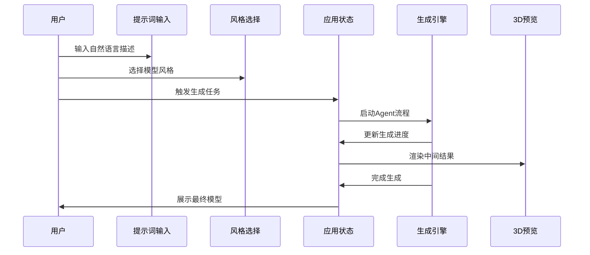
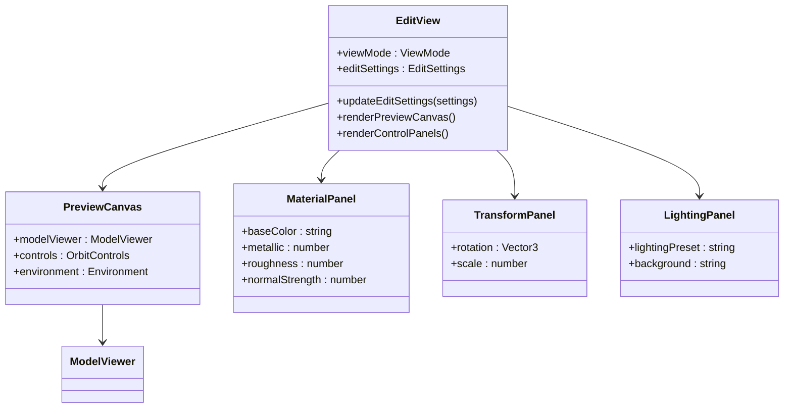
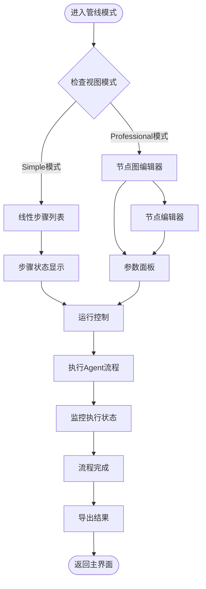
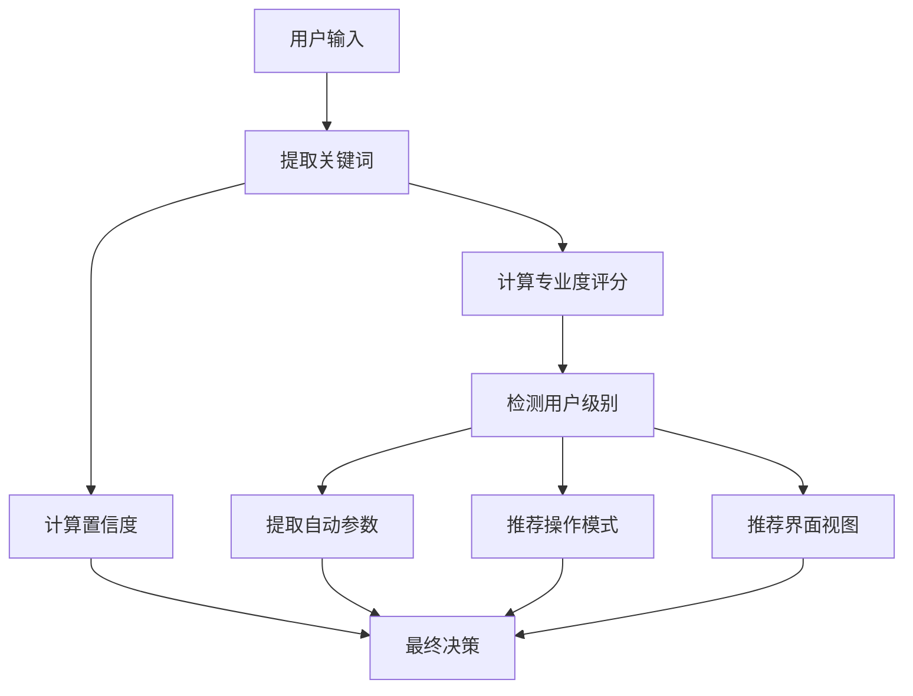

# 项目概述

<cite>
**本文档引用的文件**
- [package.json](file://package.json)
- [App.tsx](file://src/App.tsx)
- [main.tsx](file://src/main.tsx)
- [useAppStore.ts](file://src/store/useAppStore.ts)
- [index.ts](file://src/types/index.ts)
- [ExploreView.tsx](file://src/components/Explore/ExploreView.tsx)
- [EditView.tsx](file://src/components/Edit/EditView.tsx)
- [PipelineView.tsx](file://src/components/Pipeline/PipelineView.tsx)
- [intentDetector.ts](file://src/utils/intentDetector.ts)
- [mockData.ts](file://src/utils/mockData.ts)
- [Header.tsx](file://src/components/Layout/Header.tsx)
- [ModeSwitch.tsx](file://src/components/Layout/ModeSwitch.tsx)
- [ModelViewer.tsx](file://src/components/Shared/ModelViewer.tsx)
- [index.html](file://index.html)
- [vite.config.ts](file://vite.config.ts)
- [tailwind.config.js](file://tailwind.config.js)
- [tsconfig.json](file://tsconfig.json)
</cite>

## 目录
1. [引言](#引言)
2. [项目结构](#项目结构)
3. [核心组件](#核心组件)
4. [架构总览](#架构总览)
5. [详细组件分析](#详细组件分析)
6. [依赖关系分析](#依赖关系分析)
7. [性能考虑](#性能考虑)
8. [故障排除指南](#故障排除指南)
9. [结论](#结论)
10. [附录](#附录)

## 引言
本项目是一个AI驱动的3D模型生成平台，旨在通过自然语言描述实现从概念到高质量3D模型的自动化生产。项目采用React + Three.js + Zustand的技术栈组合，构建了一个支持探索式生成、专业级编辑和可编排Agent流程的全链路工作流。

平台的核心价值在于降低3D创作门槛，让非专业用户也能通过简单的自然语言指令生成复杂的3D模型，同时为专业用户提供深度定制和流程控制能力。通过智能意图识别、渐进式功能解锁和多模式交互体验，项目实现了从初学者到专家用户的完整覆盖。

## 项目结构
项目采用基于功能域的组织方式，主要分为以下层次：



**图表来源**
- [main.tsx:1-14](file://src/main.tsx#L1-L14)
- [App.tsx:10-32](file://src/App.tsx#L10-L32)
- [useAppStore.ts:100-311](file://src/store/useAppStore.ts#L100-L311)

**章节来源**
- [package.json:1-35](file://package.json#L1-L35)
- [vite.config.ts:1-12](file://vite.config.ts#L1-L12)
- [tsconfig.json:1-25](file://tsconfig.json#L1-L25)

## 核心组件
项目的核心组件围绕三大功能模式构建：探索模式、编辑模式和管线模式，每个模式都有其特定的用户群体和使用场景。

### 应用状态管理
应用状态通过Zustand进行集中管理，实现了用户配置、生成任务、编辑设置等功能的统一存储和响应式更新。

### 意图识别系统
内置的智能意图识别系统能够分析用户输入的自然语言，自动判断用户的专业水平并推荐相应的操作模式和界面视图。

### 3D渲染引擎
基于Three.js和@react-three/fiber构建的现代3D渲染系统，支持多种几何体、材质和光照效果，为用户提供沉浸式的3D预览体验。

**章节来源**
- [useAppStore.ts:50-98](file://src/store/useAppStore.ts#L50-L98)
- [intentDetector.ts:77-147](file://src/utils/intentDetector.ts#L77-L147)
- [ModelViewer.tsx:6-21](file://src/components/Shared/ModelViewer.tsx#L6-L21)

## 架构总览
项目采用分层架构设计，确保了良好的可维护性和扩展性：

```mermaid
graph TB
subgraph "表现层"
UI_Components[UI组件层]
Views[视图组件]
Layout[布局组件]
end
subgraph "业务逻辑层"
Store[状态管理]
Utils[工具函数]
Hooks[自定义Hook]
end
subgraph "数据层"
LocalStorage[本地存储]
MockData[模拟数据]
Types[类型定义]
end
subgraph "渲染层"
ThreeJS[Three.js引擎]
Fiber[@react-three/fiber]
Drei[@react-three/drei]
end
UI_Components --> Views
Views --> Store
Store --> LocalStorage
Utils --> Store
Hooks --> Store
Store --> ThreeJS
ThreeJS --> Fiber
Fiber --> Drei
MockData --> Store
Types --> Store
```

**图表来源**
- [App.tsx:1-33](file://src/App.tsx#L1-L33)
- [useAppStore.ts:1-368](file://src/store/useAppStore.ts#L1-L368)
- [ModelViewer.tsx:1-156](file://src/components/Shared/ModelViewer.tsx#L1-L156)

### 技术栈选择理念
- **React**: 提供声明式UI和组件化开发体验
- **Three.js + @react-three/fiber**: 实现高性能Web 3D渲染
- **Zustand**: 轻量级状态管理，避免过度工程化
- **TailwindCSS**: 快速样式开发和主题一致性
- **Vite**: 现代化构建工具，提供极速开发体验

## 详细组件分析

### 探索模式（ExploreView）
探索模式是项目的核心入口，面向初学者和一般用户，提供简单直观的3D模型生成体验。



**图表来源**
- [ExploreView.tsx:11-263](file://src/components/Explore/ExploreView.tsx#L11-L263)
- [useAppStore.ts:107-158](file://src/store/useAppStore.ts#L107-L158)

探索模式的关键特性包括：
- 自然语言到3D模型的直接映射
- 多种预设风格模板
- 渐进式生成进度展示
- 专业模式下的详细Agent步骤追踪

**章节来源**
- [ExploreView.tsx:1-263](file://src/components/Explore/ExploreView.tsx#L1-L263)
- [mockData.ts:74-176](file://src/utils/mockData.ts#L74-L176)

### 编辑模式（EditView）
编辑模式专为需要精细调整的用户提供专业级3D模型编辑能力。



**图表来源**
- [EditView.tsx:9-159](file://src/components/Edit/EditView.tsx#L9-L159)
- [ModelViewer.tsx:136-156](file://src/components/Shared/ModelViewer.tsx#L136-L156)

编辑模式的核心功能：
- 材质系统的专业级调节
- 几何变换的精确控制
- 多种光照环境的实时预览
- 导出和分享功能

**章节来源**
- [EditView.tsx:1-159](file://src/components/Edit/EditView.tsx#L1-L159)
- [ModelViewer.tsx:1-156](file://src/components/Shared/ModelViewer.tsx#L1-L156)

### 管线模式（PipelineView）
管线模式面向高级用户和专家，提供完整的Agent流程可视化和控制能力。



**图表来源**
- [PipelineView.tsx:9-168](file://src/components/Pipeline/PipelineView.tsx#L9-L168)

管线模式的设计特点：
- 可视化的Agent节点图
- 详细的执行参数配置
- 实时的流程监控
- 高度可定制的工作流

**章节来源**
- [PipelineView.tsx:1-168](file://src/components/Pipeline/PipelineView.tsx#L1-L168)

### 意图识别系统
项目内置的智能意图识别系统能够自动分析用户输入并提供个性化的用户体验。



**图表来源**
- [intentDetector.ts:77-147](file://src/utils/intentDetector.ts#L77-L147)

意图识别系统的关键算法：
- 多层级关键词匹配（高、中、低优先级）
- 专业度评分计算
- 用户历史行为加权
- 自动参数提取规则

**章节来源**
- [intentDetector.ts:1-148](file://src/utils/intentDetector.ts#L1-L148)

## 依赖关系分析
项目的技术依赖关系体现了清晰的分层架构：

```mermaid
graph LR
subgraph "前端框架层"
React[React 18.3.1]
Router[React Router DOM]
end
subgraph "3D渲染层"
Three[Three.js 0.164.1]
Fiber[@react-three/fiber]
Drei[@react-three/drei]
end
subgraph "状态管理层"
Zustand[Zustand 4.5.2]
end
subgraph "动画层"
Framer[Framer Motion 11.2.10]
end
subgraph "图标层"
Lucide[Lucide React]
end
subgraph "构建工具层"
Vite[Vite 5.2.13]
Tailwind[TailwindCSS 3.4.4]
TypeScript[TypeScript 5.4.5]
end
React --> Fiber
Fiber --> Three
React --> Zustand
React --> Framer
React --> Router
React --> Lucide
Fiber --> Drei
Vite --> React
Tailwind --> React
TypeScript --> React
```

**图表来源**
- [package.json:11-32](file://package.json#L11-L32)
- [vite.config.ts:1-12](file://vite.config.ts#L1-L12)

**章节来源**
- [package.json:1-35](file://package.json#L1-L35)
- [tailwind.config.js:1-61](file://tailwind.config.js#L1-L61)

## 性能考虑
项目在多个层面进行了性能优化：

### 渲染性能
- 使用@react-three/fiber的批处理渲染机制
- 3D场景的懒加载和内存管理
- 材质和几何体的缓存策略
- 环境贴图的智能切换

### 状态管理性能
- Zustand的轻量级状态管理模式
- 部分状态的本地持久化
- 避免不必要的组件重渲染
- 优化的订阅机制

### 开发体验
- Vite提供的热重载和快速构建
- TypeScript的静态类型检查
- TailwindCSS的原子化样式
- 现代化的开发工具链

## 故障排除指南
常见问题及解决方案：

### 3D渲染问题
- **场景不显示**: 检查浏览器对WebGL的支持和权限设置
- **渲染卡顿**: 关闭不必要的光照效果或降低纹理分辨率
- **材质异常**: 确认PBR材质参数的合理性

### 状态同步问题
- **界面不同步**: 检查Zustand状态订阅是否正确
- **数据丢失**: 验证localStorage的可用性和权限
- **性能下降**: 清理未使用的状态和监听器

### 构建问题
- **依赖安装失败**: 清理node_modules和重新安装
- **热重载失效**: 检查Vite配置和端口占用情况
- **样式异常**: 验证TailwindCSS配置和类名拼写

**章节来源**
- [ModelViewer.tsx:128-134](file://src/components/Shared/ModelViewer.tsx#L128-L134)
- [useAppStore.ts:313-325](file://src/store/useAppStore.ts#L313-L325)

## 结论
3D模型代理项目通过创新的技术架构和设计理念，成功地将复杂的AI驱动3D生成流程简化为直观易用的用户体验。项目不仅满足了初学者的快速创作需求，也为专业用户提供了深度定制和流程控制能力。

技术选型的合理性体现在：
- React + Three.js + Zustand的组合既保证了开发效率又确保了性能表现
- 渐进式功能解锁机制有效降低了学习成本
- 智能意图识别系统提升了用户体验的个性化程度
- 模块化的组件设计便于未来的功能扩展

项目的未来发展潜力巨大，可以在保持现有优势的基础上，进一步完善AI生成算法、扩展支持的3D格式和集成更多的创意工具。

## 附录

### 应用场景
- **创意设计**: 快速生成概念模型和设计原型
- **电商产品**: 自动生成产品3D展示模型
- **游戏开发**: 快速制作游戏资产和场景元素
- **教育培训**: 提供3D创作教学和实践平台

### 目标用户群体
- **初学者**: 通过自然语言快速创建3D模型
- **设计师**: 进行创意探索和概念验证
- **开发者**: 集成到更大的3D创作工作流
- **教育机构**: 作为3D教学和培训工具

### 核心价值主张
- **易用性**: 无需3D专业知识即可创作高质量模型
- **效率性**: 将传统3D创作时间缩短数倍
- **可访问性**: 支持多种设备和浏览器环境
- **可扩展性**: 模块化架构支持功能持续演进